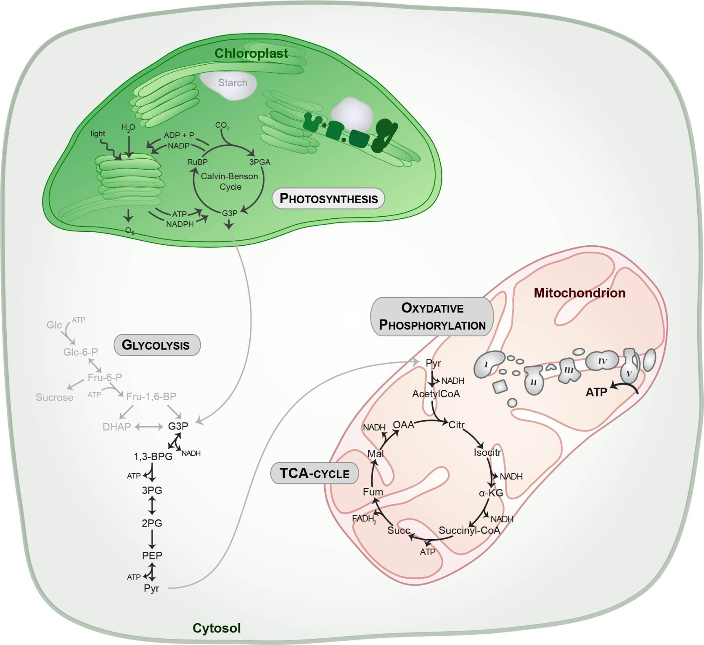
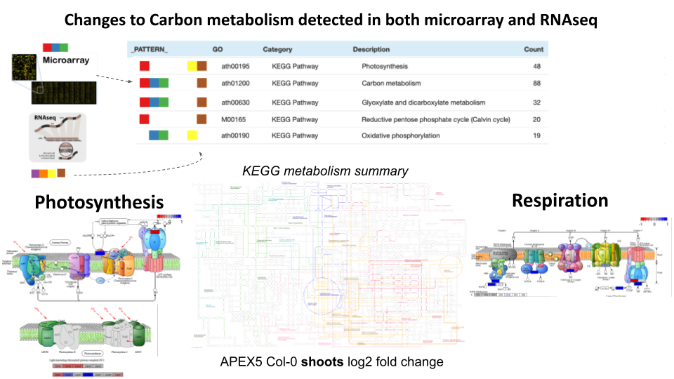
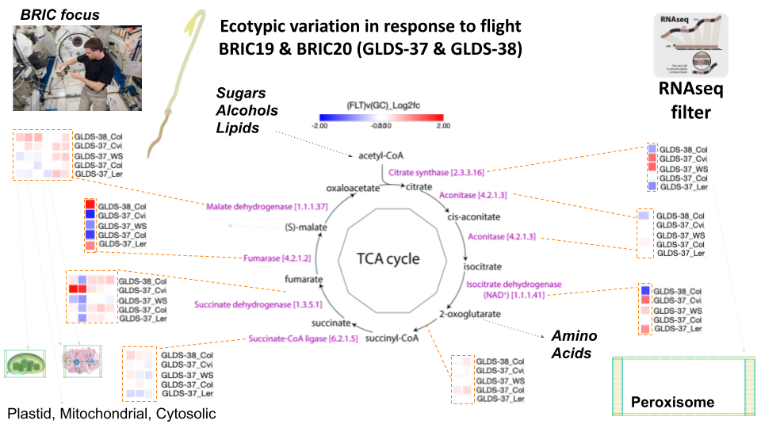
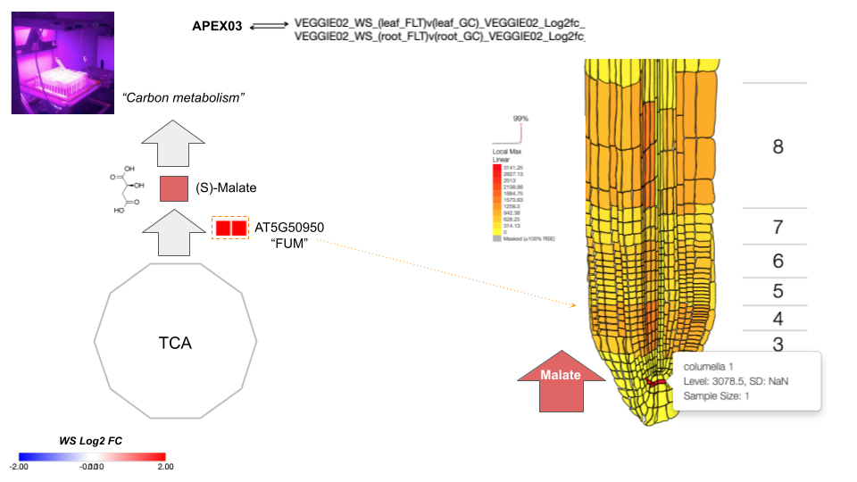
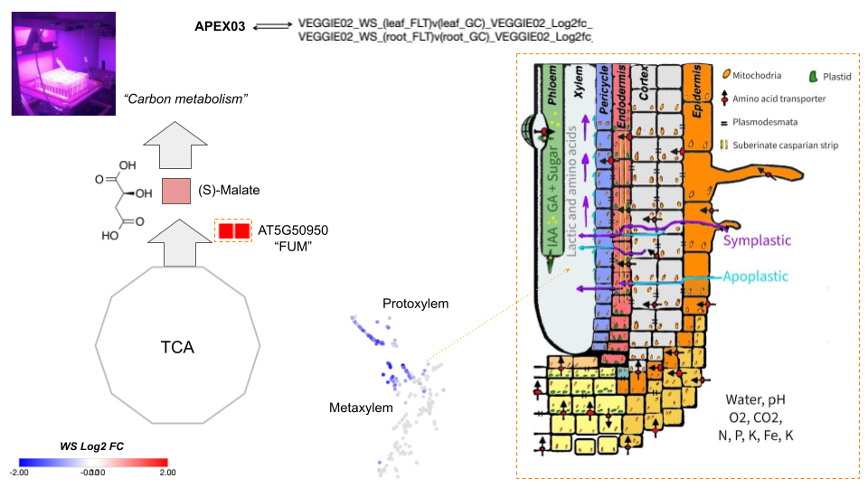
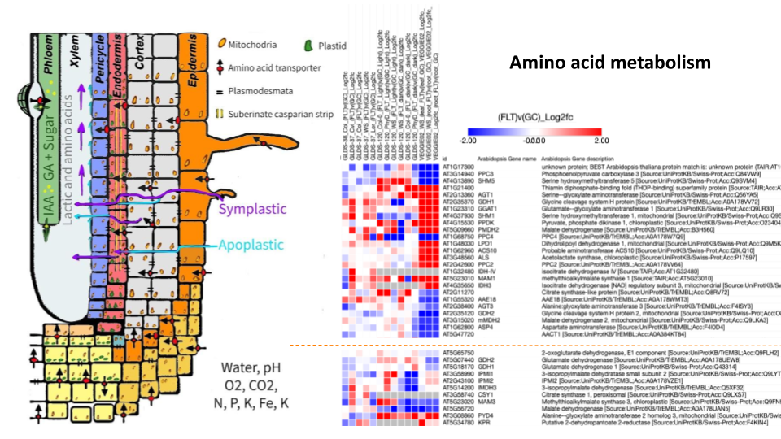
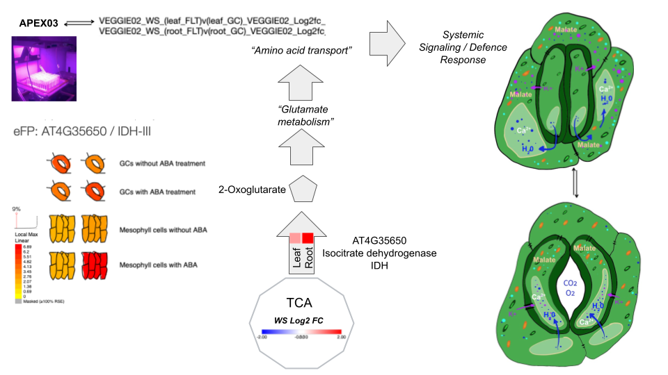
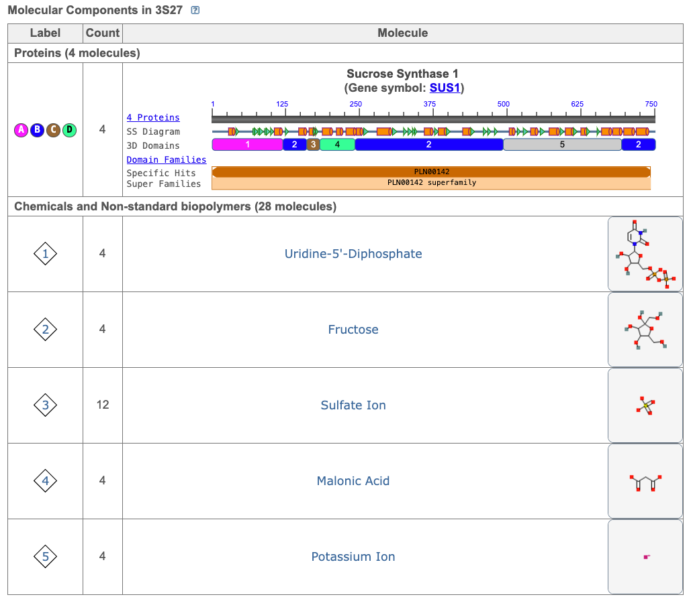

# DRB Spaceflight plant respiration review

**Review of the last 4 years of astrobotany**

**Review of plant respiration**

**Title:** Respiration in microgravity isn’t easy, even if you’re green.

**Abstract**: The process of anaerobic respiration plays a crucial role in plant physiology and has the potential to be harnessed to improve crop yield. To effectively manipulate this process, a deeper understanding of respiratory substrates is necessary. Mitochondria, the organelles that house the catabolic pathways and respiratory machinery, are central to this understanding, as they control the transport of substrates into and out of the organelles. However, the complex nature of mitochondrial carriers and catabolic pathways, which are not yet fully identified, presents a significant obstacle to probing respiratory substrates in plants. Moreover, respiratory substrates are subject to regulation based on cellular processes and spaceflight-related environmental factors. In this review, we explore the expression of enzymes related to the direct respiratory substrates that are transported through mitochondrial carriers and catabolized under normal and stressed conditions. Additionally, we suggest we need to evaluate the energetic yields, availability in cells, and the degree of oxidation of various respiratory substrates and cofactors during spaceflight. This information can be useful in determining which synthetic biology approaches may be suitable for altering the range of respiratory substrates in plants tailored for fractional gravity levels, ultimately optimizing respiration through the introduction, improvement, or control of specific mitochondrial transporters and catabolic pathways. Furthermore, the insights gained from this review can provide a foundation for future research aimed at improving crop yields and addressing the challenges associated with spaceflight and microgravity environments.

**Keywords: Mitochondria, TCA, spaceflight,**

_**“This is a crude mix of spaceflight and metabolic engineering review.” but it has potential?**_

**𝐓𝐡𝐞 𝐞𝐛𝐛𝐬 𝐚𝐧𝐝 𝐟𝐥𝐨𝐰𝐬 𝐨𝐟 𝐞𝐧𝐞𝐫𝐠𝐲 by** [**Dr. Daria Chrobok**](https://www.linkedin.com/in/dariachrobok?miniProfileUrn=urn%3Ali%3Afsd\_profile%3AACoAABl3-n0BFOSDEz-CVxabBP\_5mNuKIILs5Pg)

[**“I love to help make your Science memorable! How?**](https://www.linkedin.com/in/dariachrobok?miniProfileUrn=urn%3Ali%3Afsd\_profile%3AACoAABl3-n0BFOSDEz-CVxabBP\_5mNuKIILs5Pg)

[**With beautiful illustrations! Let's connect & see if I can help you!”**](https://www.linkedin.com/in/dariachrobok?miniProfileUrn=urn%3Ali%3Afsd\_profile%3AACoAABl3-n0BFOSDEz-CVxabBP\_5mNuKIILs5Pg)

<figure><figcaption></figcaption></figure>

**Introduction.**

Photosynthesis and respiration are two vital processes in the life cycle of plants on Earth and in space. Photosynthesis assimilates CO2 into carbon-rich molecules, whereas respiration oxidizes 30%–60% of those molecules and releases CO2 back into the environment (Raich et al., 2014; Amthor et al., 2019). While photosynthesis relies on a single substrate, CO2, respiration involves a complex range of reduced carbon molecules that serve as respiratory fuel sources, including sugars, amino acids, organic acids, fatty acids, chlorophylls, and other carbon compounds (Hörtensteiner and Kräutler, 2011; O'Leary et al., 2019). The selection of substrates for respiration is regulated by metabolic enzyme abundances and regulations inside cells, which might not be optimized for the environments and conditions encountered by many plants in managed environments today. Direct substrates for respiration are defined as those transported into the mitochondrial matrix and metabolized to generate reducing equivalents, which can be used to drive the electron transport chain (ETC) and oxidative phosphorylation in mitochondria with or without CO2 release. However, respiration is not a straightforward process, as partial oxidation of respiratory substrates and the operation of non-phosphorylating bypasses in the ETC limit the efficiency of ATP generation (Millar et al., 2011). The ideal balance between "maintenance" and "growth" respiration is a matter of debate, and it is unclear whether certain substrates drive its rate (Padmasree et al., 2002; Araújo et al., 2014; Vanlerberghe et al., 2020; Scafaro et al., 2021). The concept of "optimal respiration" which balances cellular redox states, contributes to ideal photosynthetic capacity and supports growth, biomass, and yield is difficult to quantify (Tcherkez et al., 2017; O'Leary et al., 2019). Our understanding of the major respiratory substrates throughout the diurnal cycle, under stress conditions, and across plant development is incomplete. Microgravity and other conditions experienced during spaceflight can have a significant impact on plant respiration. Studies have shown that microgravity can lead to changes in plant metabolic pathways, including respiration (Ferl and Paul, 2016). Therefore, understanding and optimizing respiratory substrates in plants under these unique conditions is crucial. This review aims to provide an update on recent discoveries of respiratory substrates under normal terrestrial conditions and then contrast them with plant response to spaceflight, in an attempt to identify gaps in our current understanding as we seek respiratory optimization in plants for agroecosystems on earth, LEO and beyond.

<figure><figcaption></figcaption></figure>

**Figure 1:** Differentially expressed pathways from the matrix meta-transcriptome. KEGG pathway viewer shows changes in photosynthetic and respiration-related apparatus and downstream metabolic pathways (Supplementary figure Barker et al., 2023).

**Respiration in plant roots**

Arabidopsis root tissues have varying functions and undergo respiration through different pathways and reactions depending on their stage of development. The epidermal cells, in their mature stage, synthesize cutin to prevent water loss and are sensitive to drought and salt stress. The trichoblasts, in their elongation stage, elongate root hairs for nutrient uptake and synthesize flavonoids for UV protection, and are sensitive to nutrient deficiencies and UV radiation. The cortical cells, in their mature stage, synthesize cellulose for cell wall strength and lipid metabolism for energy storage and are sensitive to salt stress and fungal pathogens. The endodermal cells, in their mature stage, synthesize suberin to control water and nutrient uptake and are sensitive to water stress and nutrient deficiencies. The pericycle cells, in their elongation stage, transport auxin for root growth and lateral root initiation and are sensitive to auxin-deficient conditions. The vascular cells, in their differentiation stage, form xylem and phloem for nutrient and water transport and synthesize lignin for cell wall strength, and are sensitive to water stress and fungal pathogens. The root cap cells, in their differentiation stage, synthesize mucilage for seed germination and gravity sensing for root orientation and are sensitive to gravity and water stress. Finally, the quiescent center cells, in their maintenance stage, maintain stem cells for growth and repair, and are sensitive to DNA damage and oxidative stress. Thus, respiration rates change as cells progress through developmental stages in Arabidopsis root tissues. In general, younger cells have higher respiration rates than older cells, as they are actively dividing and require more energy. During the early stages of development, the root apical meristem, where new cells are generated, has high respiration rates. As the cells differentiate and become specialized, respiration rates decrease. Once the cells have matured and stopped dividing, their respiration rates stabilize at a lower level. Additionally, respiration rates may also vary depending on environmental conditions, such as temperature, oxygen availability, and nutrient availability (**See Root Tissue Table X).**

**Pyruvate transporters**

Pyruvate serves as the primary substrate for eukaryotic mitochondrial respiration rate, and its transportation to the mitochondrial matrix is facilitated by mitochondrial pyruvate carriers (MPCs) residing in the inner mitochondrial membrane. The first step of pyruvate oxidation is carried out in the matrix by the mitochondrial pyruvate dehydrogenase complex (mtPDC) that yields acetyl-CoA, NADH, and CO2. Knocking out either MPCs or mtPDC has been found to have a detrimental effect on mammalian cell development (Gray et al., 2014; McCommis et al., 2015; Johnson et al., 2001; Gopal et al., 2018). In contrast, the plasticity of pyruvate provision to respiration in plant mitochondria appears to be greater. Mutations in PDC subunits in Arabidopsis cause retardation in organ size and root length, but abolition of pyruvate mitochondrial transport does not grossly affect plant vegetative growth phenotypes (LeClere et al., 2004; Taylor et al., 2004; Quint et al., 2009; Yu et al., 2012; Song and Liu, 2015; Li et al., 2014; Wang et al., 2014; He et al., 2019). However, detailed biochemical studies of mutants in transporters and metabolic enzymes in Arabidopsis show that while pyruvate imported via MPC is a major pathway providing pyruvate to mitochondria, at least two other pathways work cooperatively with MPC to provide sufficient pyruvate for plant respiration and growth (Le et al., 2021). These include pyruvate production from alanine and malate inside the mitochondria, internal pyruvate production via NAD-dependent malic enzyme (NAD-ME), and an alanine shuttle via reversible alanine aminotransferase (AlaAT) reactions that are situated in the cytosol and the mitochondrial matrix (Liepman and Olsen, 2003). This means that alanine and malate act as direct respiratory substrates via their conversions to pyruvate inside plant mitochondria. Loss of any one of these systems does not affect vegetative phenotypes in Arabidopsis (Le et al., 2021).

**Figure 2:** Natural variation of expression of loci associated with the TCA cycle in the BRIC hardware during BRIC19 and BRIC20. RNAseq analysis.

Vector files can replace from DRB AWG supplementary slides

Spaceflight and microgravity have been found to have an impact on mitochondrial respiration in various organisms, including plants (**GeneLab REF, Choi et al., 2017, Barker et al etc..?**). In Arabidopsis, spaceflight has been shown to increase the activity of the alternative oxidase pathway, which is involved in mitochondrial respiration, suggesting a shift in respiratory substrate utilization (Battista et al., 2020). Microgravity has also been found to affect mitochondrial respiration and energy metabolism in human cells, which could have implications for long-term spaceflight missions (Wang et al., 2017). Thus, understanding the various pathways involved in providing pyruvate as a respiratory substrate in different organisms and the effects of spaceflight and microgravity on mitochondrial respiration is essential for developing strategies to support life in space.

**Pyruvate**

The production of pyruvate is vital for plant respiration, which relies heavily on the catabolism of daily replenished starch reserves and sugars from photosynthesizing tissues (MacNeill et al., 2017). Cytosolic glycolysis is the primary source of pyruvate for mitochondrial respiration, which is mainly fed via the triose phosphate translocator (TPT) that exports 3-PGA produced via the Calvin–Benson cycle from chloroplasts to the cytosol (Walters et al., 2004; Schmitz et al., 2012). In addition, a physical association of chloroplasts and mitochondria, through TPT, provides direct usage of plastid 3-PGA to produce pyruvate via MPC for mitochondrial respiration in the light (Zhang et al., 2020). The effects of spaceflight and microgravity on plants have been found to influence respiration rate, photosynthesis, and the production of reactive oxygen species (ROS), which affects plant growth and development (Paul et al., 2019).

**Alanine**

Pyruvate is also produced via alanine aminotransferase (AlaAT), which converts alanine into pyruvate, thus ensuring the supply of pyruvate from versatile and available carbon and nitrogen storage molecules. This interconversion has been shown to be essential in plant hypoxia responses and is considered the most commonly employed metabolite transported in C4 plants (Mallmann et al., 2014; Rao and Dixon, 2016; Schlüter et al., 2019). Interestingly, over-expression of AlaAT in plants increased biomass and yield, indicating that the flexibility of using pyruvate and alanine as respiratory substrates can influence plant yield (McAllister and Good, 2015; Good et al., 2007; Shrawat et al., 2008). The effects of spaceflight and microgravity on this interconversion have been studied, and it has been found that plants grown in microgravity exhibit altered gene expression patterns that indicate changes in amino acid metabolism (Zupanska et al., 2013).

Spaceflight and microgravity have been known to have various effects on biological systems, including changes in metabolism and gene expression. In plant cells, stored organic acids such as malate play important roles in the TCA cycle, which is essential for energy production. Malate enters the cycle through NAD-malate dehydrogenase (NAD-MDH), the final enzyme in the cycle that ensures optimal ATP production in the dark (Tomaz et al., 2010). Malate also participates in a shuttle with oxaloacetate to influence the NADH/NAD+ ratio, indirectly activating components of the respiratory apparatus and playing various roles in stomata closure, pH, and redox balance (Selinski and Scheibe, 2019). Recent studies have shown that there are at least two major pathways to import malate into the mitochondrial matrix in plant cells, suggesting that different transport mechanisms might also be able to support segregated roles of malate inside mitochondria (Lee et al., 2021). Furthermore, malate accumulates in the vacuole during the day and is used as a respiratory substrate at the end of the night, promoting the usage of amino acids, fatty acids, and even chlorophylls for respiration (Fahnenstich et al., 2007; Maurino and Engqvist, 2015). These findings highlight the importance of malate and NAD-MDH in the TCA cycle, and their potential role in adapting to spaceflight and microgravity conditions.

**Malate**

The oxidation of malate to form pyruvate via NAD-ME produces NAD(P)H and CO2 and has a high respiratory quotient of complete oxidation of malate, but its use as a respiratory substrate via NAD-ME is limited, even when MPC and AlaAT are absent, which leads to deficiencies in both shoot and root growth (Le et al., 2021). Pyruvate imported via MPC is prioritized over NAD-ME-derived pyruvate to provide the carbon backbone for citrate production in the TCA cycle and respiration due to the substrate channeling-like behaviour between MPC and PDC (Le et al., 2022). Pyruvate made from imported malate is prioritized to be exported to support biosynthesis of amino acids or fatty acids in other cell compartments (Le et al., 2021). The effects of spaceflight and microgravity on NAD-ME and malate metabolism in plants have not been widely studied, but the malate biosynthesis enzyme FUM was shown to be elevated in WS Arabidopsis seedlings roots and shoots when grown in light I. The Veggie hardware and the ISS (fig.3)

<figure><figcaption></figcaption></figure>

<figure><figcaption></figcaption></figure>

**Figure 3:** FUM expression during the VEGGIEs 02 mission. EPlant EFP browser predicts high expression in the columella 1st tier cells, along with predicted expression in the meristematic and elongation region, while single cells sequencing data from the EBI expression atlas predict protoxylem expression.

**Citrate**

Citrate, a versatile organic acid produced by the TCA cycle, serves as a crucial respiratory substrate during both the day and night. In the light, citrate is generated by a non-cyclic form of the TCA cycle and is exported for vacuolar storage or amino acid biosynthesis (Eprintsev et al., 2015b). Conversely, respiration by the cyclic TCA cycle extracts energy from citrate at night (Cheung et al., 2014; Tcherkez et al., 2017). Citrate is stored in the vacuole at high concentrations, suggesting its potential to act as a respiratory substrate. In fact, citrate can re-enter mitochondria via citrate importers and enter the TCA cycle when glycolytic flux and NADH concentration are low, indicating its importance as a respiratory substrate (Igamberdiev and Eprintsev, 2016).

In addition to its role as a respiratory substrate, citrate also plays a crucial role in redox balance. A homolog of the succinate-fumarate carrier (SFC) has been shown to exhibit citrate/isocitrate exchange transport activity, indicating its potential to transport citrate (Brito et al., 2020). The MDH-citrate synthase-aconitase (MDH-CS-ACO) metabolon reserves a pool of mitochondrial citrate for further oxidation to generate NADH (Huang et al., 2018). In yeast, a separate citrate synthase-citrate exporter metabolon has been identified to generate a protected pool of citrate for export from mitochondria (Grigorenko et al., 1990). While the latter has yet to be confirmed in plants, the role of DIC2 in importing malate in exchange for mitochondrial citrate suggests a pool of mitochondrial citrate is exported to generate NADPH in the cytosol to create reducing power in the light for maintenance respiration and secondary metabolism (Lee et al., 2021).

The effects of spaceflight and microgravity on citrate metabolism have been studied extensively, with evidence showing changes in citrate synthesis and export in microgravity conditions (Choi et al., 2017). These changes have been attributed to the altered expression of genes involved in the citrate metabolic pathway, indicating the potential for microgravity to affect citrate metabolism at the molecular level (Choi et al., 2017; Ferl and Paul, 2016). Moreover, studies have also shown that microgravity can lead to changes in the morphology and structure of mitochondria, potentially affecting their ability to generate and utilize citrate as a respiratory substrate (Ferl and Paul, 2016). Overall, the multifaceted roles of citrate in plant metabolism, coupled with its sensitivity to microgravity conditions, make it an intriguing subject of study for understanding the effects of spaceflight on plant physiology.

**Succinate**

Succinate is a key molecule involved in energy metabolism in plant cells. It can be synthesized from succinyl-CoA within the TCA cycle in plant mitochondria, as well as imported into mitochondria from the cytosol via transporters such as DICs and SFC (Picault et al., 2002; Palmieri et al., 2008; Catoni et al., 2003). In mitochondria, succinate contributes directly to respiration by transferring electrons within complex II to ubiquinone, while also indirectly contributing to the production of malate and NADH (Huang and Millar, 2013; Belt et al., 2017; Restovic et al., 2017).

Beyond the TCA cycle, succinate can also be produced via the glyoxylate cycle in peroxisomes during germination of oil-storing seeds, and in leaves during photosynthesis (Eprintsev et al., 2015a). The glyoxylate cycle allows for lipid mobilization and the production of succinate and malate, which can be exported to the cytosol for gluconeogenesis (Cornah et al., 2004; Eastmond et al., 2015). Succinate generated through the glyoxylate cycle can then enter the TCA cycle, producing NADH and ATP (Eastmond and Graham, 2001; Thorneycroft et al., 2001).

Interestingly, spaceflight and microgravity have been shown to affect plant metabolism, including the production of succinate. In Arabidopsis plants grown in space, changes in gene expression and metabolite levels were observed, including upregulation of genes involved in the TCA cycle and glyoxylate cycle, as well as increased levels of succinate and malate (Zupanska et al., 2013). Similarly, studies on Arabidopsis seedlings grown in microgravity found alterations in metabolite levels, including a significant increase in succinate compared to ground controls (Valbuena et al., 2019). These findings suggest that spaceflight and microgravity may impact plant metabolism and the production of key metabolites such as succinate, potentially affecting plant growth and development in these unique environments.

**Glycine**

The utilization of photosynthetic by-products to generate energy is a crucial process in plant metabolism. Glycine is one such low-cost amino acid that plays a pivotal role as a respiratory substrate under normal conditions. In fact, in C3 plants, glycine oxidation is the primary pathway for mitochondrial redox equivalent generation in the light, accounting for more than 50% of mitochondrial NADH, especially under high light conditions which has been shown previously to transcriptionally resemble space flight perceived within a BRIC (Choi et al., 2017). The transportation of glycine into plant mitochondria is inhibited by mersalyl and glycine analogues, but the exact carrier involved remains unknown. Once imported, glycine is converted to serine in the mitochondria via GDC and serine hydroxymethyltransferase, releasing CO2, NH4+, and NADH. Additionally, the effects of spaceflight and microgravity on plant metabolism have been shown to have an impact on the photorespiratory cycle and the generation of respiratory substrates such as glycine. Studies have demonstrated alterations in the activity of key enzymes and changes in the levels of metabolites in plants grown under microgravity conditions. Therefore, the optimized use of glycine and other respiratory substrates to generate energy in plants is a fascinating area of research that could have implications for space agriculture and exploration.

**Amino Acids**

Plants typically use carbohydrates as their primary respiratory substrate, but under conditions of insufficient carbohydrate supply, they turn to amino acids from protein degradation as alternative respiratory substrates. However, not all amino acids are equally suitable for respiration, as some are energetically expensive to synthesize and incorporate into proteins. For example, amino acids like proline, glutamate, and branched-chain amino acids (BCAAs) are used as alternative respiratory substrates during stress recovery, while high-cost amino acids like arginine, histidine, tyrosine, tryptophan, and phenylalanine are generally used as precursors for secondary metabolites. The catabolic machinery responsible for degradation of most aromatic amino acids in plants remains unclear. Furthermore, formate, a byproduct of abiotic stress, is oxidized in mitochondria.

<figure><figcaption></figcaption></figure>

**Figure X:** Summary of amino acid metabolism from GeneLab.

Vector file can replace from DRB AWG supplementary slides

**Proline**

The effects of spaceflight and microgravity on plants also impact their respiratory substrates. Proline, which is known to accumulate during salt and osmotic stress, has been found to play important roles in osmoprotection and reactive oxygen species (ROS) defense. During proline catabolism, plant mitochondria contain proline dehydrogenase and 1-pyrroline-5-carboxylate dehydrogenase to catalyze this process. Proline acts as a respiratory substrate in intact plant tissues and isolated plant mitochondria, but its catabolism can exceed the capacity and energy demand of plant cells, inducing the expression of non-phosphorylating bypasses such as alternative oxidase (AOX). The loss of expression of AOX results in increased ROS generation and a prolonged recovery period for plants following proline accumulation due to salt stress and has previously been shown to be affected by spaceflight in a metaanalysis by Barker et al., (2020). On the other hand, during dark-induced senescence, proline oxidation has been shown to generate glutamate and the electron flux passes through the cytochrome pathway for ATP synthesis.

**Glutamate**

Spaceflight and microgravity have been shown to have a significant impact on plant physiology and metabolism, including the amino acid glutamate and its role in nitrogen and carbon status signaling in plant cells. Glutamate has been identified as a major amino acid linking carbon and nitrogen metabolism, particularly during germination (Day et al., 1988). Studies have demonstrated that glutamate is imported into plant mitochondria via A BOUT DE SOUFFLE (BOU), a protein homologous to yeast mitochondrial glutamate transporter protein Ycm2p (Eisenhut et al., 2013; Porcelli et al., 2018). Within the mitochondria, glutamate is oxidized by glutamate dehydrogenase (GDH) to produce 2-OG, NADH, NH4+, and CO2, primarily operating in the direction of deaminating glutamate to 2-OG to fuel the TCA cycle (Labboun et al., 2009). Under stress conditions, cytosolic glutamate can serve as a source of γ-aminobutyric acid (GABA) through glutamate decarboxylase in the cytosol (Qiu et al., 2020). GABA is then transported into mitochondria via GABA permease (GABP) where the GABA shunt enzymes produce succinate to enter the TCA cycle and generate NADH (Michaeli et al., 2011). This alternative metabolic pathway has been found to be activated in a wide range of plant stresses, including starvation, salinity, and hypoxia (Rolletschek et al., 2011; António et al., 2016; Wang et al., 2017; Che-Othman et al., 2020; Jethva et al., 2022). The GABA shunt plays a crucial role in facilitating increased respiration of wheat leaves by providing an alternative carbon source for metabolic processes such as ion exclusion, synthesis of compatible solutes, and detoxification of ROS, particularly under conditions of limited carbon supply (Dissanayake et al., 2022). Studies have shown altered gene expression plants grown in space indicating changes in glutamate signaling that might partially explain observations such as wavy root growth and changes in tropic orientation (Paul et al., 2019).

**Branched-chain amino acids (BCAAs)**

The degradation pathways of branched-chain amino acids (BCAAs) such as valine, leucine, and isoleucine are essential for plant survival during sugar starvation (Hirota et al., 2018). BCAA catabolism primarily occurs in the cytosol, but some enzymes required for leucine degradation are present in plant mitochondria, making leucine an effective alternative substrate for respiration (Binder, 2010). In fact, key enzymes of BCAA metabolism, including branched chain α-keto acid dehydrogenase complex and isovaleryl-CoA dehydrogenase, are located inside mitochondria, generating NADH or transferring electrons from α-keto-acids to the ubiquinone pool via the electron-transfer flavoprotein/electron-transfer flavoprotein:ubiquinone oxidoreductase complex (ETF/ETFQO) (Kochevenko et al., 2012). Interestingly, the regulation of BCAA catabolism also involves sucrose non-fermenting 1-related protein kinase 1 (SNRK) bZIP signal transduction pathway, which directly regulates the promoter of ETFQO under carbon starvation (Cavalcanti et al., 2017; Pedrotti et al., 2018). Knocking out ETFQO-1, SNRK, BZIP, and other BCAA catabolism enzymes such as isovaleryl-CoA dehydrogenase not only decreased respiration rate but also caused plants to be more sensitive to extended darkness, leading to increased rates of senescence and decreased leaf quantum yield (Pedrotti et al., 2018). Furthermore, BCAA catabolism can generate acetyl-CoA in the cytosol or mitochondria, which fuels the tricarboxylic acid (TCA) cycle (Hildebrandt et al., 2015; Arruda and Barreto, 2020). BCAA accumulation is toxic to plant growth, making their metabolism a cellular priority after stress, such as during salt stress (Huang and Jander, 2017; Batista-Silva et al., 2019). Mutants lacking BCAA catabolism enzymes are also more drought-sensitive compared with wild-type plants (Engqvist et al., 2011; Pires et al., 2016). Moreover, spaceflight and microgravity have been shown to affect plant growth and metabolism. For instance, space-grown plants exhibit alterations in their gene expression and metabolic pathways, including BCAA metabolism, which may affect their overall fitness and survival in space conditions (Correll et al., 2013; Paul et al., 2017). Therefore, understanding the effects of spaceflight on BCAA metabolism in plants is crucial for space agriculture and long-term space missions.

**Serine**

Serine, an amino acid, is mainly known as a product of mitochondria rather than a respiratory substrate due to the lack of plant mitochondrial serine catabolic pathways. However, recent research suggests that serine may have a role as a substrate for mitochondrial respiration. Serine is produced in abundance from glycine during photorespiration in the light, and a large proportion is transported via the cytosol to the peroxisome to complete the cycle, with some removal for cysteine synthesis (Bonner et al., 2005). Serine can also be made from glycolytic intermediates in the cytosol or plastid and can be imported into mitochondria independently of the photorespiratory cycle (Haas et al., 2008; Kory et al., 2018). Remarkably, serine can reach concentrations >10 mM in the cytosol and in phloem sap (Igamberdiev and Kleczkowski, 2018), making it one of the most abundant amino acids after glutamate and aspartate. A plant serine dehydratase (serine racemase) in the cytosol can generate pyruvate from serine (Fujitani et al., 2006), which can enter mitochondria and contribute to respiration. The efficiency of using serine as a mitochondrial pyruvate source would be low if serine had to be exported from mitochondria and re-enter as pyruvate due to transport logistics and the presence of competing pathways in the cytosol. Interestingly, recent studies have shown that spaceflight and microgravity conditions can affect the metabolic pathways of plants, including those involving amino acids such as serine (Johnson et al., 2021; Schwendner et al., 2021). Therefore, investigating the role of serine in plant respiration under spaceflight and microgravity conditions may provide valuable insights into plant metabolism and stress responses.

**Lysine**

Lysine is an essential amino acid that plays a crucial role in plant metabolism. Its catabolism starts in the cytosol, where lysine is converted into 2-aminoadipate-6-semialdehyde (AASA). The next enzyme involved in the pathway, α-aminoadipate semialdehyde dehydrogenase, can be targeted to either the cytosol or mitochondria, producing α-aminoadipate and NADH (Arruda and Barreto, 2020; Fuchs et al., 2020). Recent studies suggest that D-2-hydroxyglutarate (D-2-HG) is generated from lysine products inside mitochondria (Engqvist et al., 2011). The mitochondrial D-2-HG dehydrogenase (D-2HGDH) oxidizes 2-HG and donates electrons to the electron transport chain (ETC) through the ETF/ETFQO complex (Araújo et al., 2010). It is possible that either AASA or 2-HG enters mitochondria as direct respiratory substrates. Interestingly, 2-HG accumulation is observed in D-2HGDH mutants and during environmental stress in plants, which might inhibit transaminases and transporters involved in the usage of other respiratory substrates (Engqvist et al., 2011).

Moreover, the effects of spaceflight and microgravity on lysine catabolism in plants have been studied. It has been observed that lysine accumulates in _Arabidopsis thaliana_ plants grown in microgravity conditions, suggesting that spaceflight alters lysine metabolism (Correll et al., 2013). Additionally, a transcriptomic analysis of plants grown in microgravity revealed alterations in the expression of genes involved in lysine metabolism and transport (Paul et al., 2019). These findings highlight the importance of understanding lysine catabolism and its regulation in plants under different environmental conditions. Furthermore, the generation of 2-oxoglutarate (2-OG) from lysine via D-2HGDH is crucial to support TCA cycle activity and enable normal respiration and biosynthesis, as it is used to compensate for mutations in NAD- and NADP-isocitrate dehydrogenase (Boex-Fontvieille et al., 2014).

**Figure XX:** WS VEGGIES02 shows changes in isocitrate dehydrogenase expression. This may be evidence of ABA signalling that can lead to changes in stomatal aperture (ref to support link).

**Formate**

Formate is a crucial molecule in plants as it is involved in several metabolic processes, including mitochondrial metabolism and photorespiration. It is known to be produced during abiotic stresses such as hypoxia, aluminum toxicity, and low pH, and its degradation is linked to mitochondrial metabolism (Nunes-Nesi et al., 2014; Lou et al., 2016). However, spaceflight and microgravity can also affect formate metabolism in plants, Studies have shown that formate accumulation is enhanced in Arabidopsis thaliana plants grown in spaceflight conditions, likely due to changes in the expression of genes involved in formate metabolism (Mortley et al., 2005; Stutte et al., 2006). Microgravity has been shown to affect the activity of formate dehydrogenase (FDH), the enzyme responsible for formate degradation, in some microorganisms (Gao et al., 2019). Formate found in plants which have been exposed to stress could be synthesized during photorespiration from serine, arise from methanol metabolism, or be made from glyoxylate (Alekseeva et al., 2011). Formate is mainly metabolized by mitochondrial FDH and formate accumulation is known to induce the expression of FDH (Hourton-Cabassa et al., 1998; Shingaki-Wells et al., 2014). The activity of FDH generates NADH inside the mitochondrial matrix which can be used by the electron transport chain and coupled to ATP synthesis and CO2 release (Alekseeva et al., 2011).

**Chlorophyll recycling**

Chlorophyll breakdown is a well-known response to various stresses, such as senescence, carbon, and/or nitrogen starvation, as well as spaceflight and microgravity (Hörtensteiner and Kräutler, 2011; Gutbrod et al., 2019). This process facilitates the recycling of nitrogen and possibly carbon from the chlorin ring and prenyl side chains, respectively. Following magnesium removal, the chlorin ring is converted into pheophorbide a, which is subsequently transformed into non-fluorescent chlorophyll catabolites that accumulate in the vacuole (Pruzinská et al., 2005; Hörtensteiner and Kräutler, 2011). Meanwhile, mass-spectrometry experiments have indicated that the main breakdown products of the prenyl side chain are phytols (Mach, 2015).

Although the phytol degradative pathway can provide substrates for respiration during sugar starvation (Ishizaki et al., 2005), the components of this pathway have not been fully identified (Durrett and Welti, 2021). Phytol can be degraded to phytenal, which accumulates in senescing oat leaves, and then to phytanoyl-CoA via unknown steps (Ishizaki et al., 2005). Phytanoyl-CoA undergoes α-oxidation and β-oxidation in peroxisomes and mitochondria in mammalian catabolic pathways (Kohlmeier, 2015; Durrett and Welti, 2021; Gutbrod et al., 2021). In plants, phytanoyl-CoA hydroxylase and 2-hydroxy-phytanoyl-CoA lyase have been localized to peroxisomes and characterized to be the main pathway of phytanoyl-CoA metabolism (Araújo et al., 2011a; Yang et al., 2022). Although plant mitochondria do not contain β-oxidation pathways, isobutyryl-CoA made from peroxisomal oxidation of phytanoyl-CoA could potentially act as a respiratory substrate by contributing electrons to the ubiquinol pool via ETF/ETFQO, leading to oxygen consumption and ATP synthesis in plant mitochondria (Däschner et al., 2001; Yang et al., 2022). However, evidence for such transport and the identity of a mitochondrial isobutyryl-CoA transporter is still lacking (Hildebrandt et al., 2015; Hildebrandt, 2018). In addition to isobutyryl-CoA, earlier steps in phytol metabolism can result in the production of acetyl-CoA, succinate, and formate (Kohlmeier, 2015), each of which can act as direct respiratory substrates via known pathways.

It is worth noting that spaceflight and microgravity have been shown to induce changes in the expression of genes related to photosynthesis and carbohydrate metabolism in plants, which in turn can affect chlorophyll breakdown and phytol metabolism (Paul et al., 2013; Dutta Gupta and Roychoudhury, 2017). Moreover, microgravity has been shown to have profound effects on plant growth and development, including altered gravitropism, changes in cell wall composition, and modifications in nutrient uptake and utilization (Kwon et al., 2019). These effects may have implications for chlorophyll breakdown and phytol metabolism in space-grown plants, which warrants further investigation.

**Acetate**

The role of acetate as a respiratory substrate in plants has often been overlooked, despite its importance in many microorganisms (De Mets et al., 2019). However, recent studies have shown that plants can use exogenously supplied acetate as a carbon source, and that acetate can be incorporated into biomass and support energy production (Hann et al., 2022). The effects of spaceflight and microgravity on plant metabolism have also been investigated, revealing that plants grown in space exhibit changes in gene expression, protein content, and metabolic pathways (Fuentes et al., 2021).

Acetate is readily produced during carbon metabolism in plant cells, and can rise to concentrations of up to 1 mM in green tissues (Bodo and Stumpf, 1982). Exogenous application of isotopically labeled acetate to plants shows that labelled carbon rapidly enters the TCA cycle, suggesting that acetate is converted into acetyl-CoA in plastids and peroxisomes, and then enters the mitochondria as a respiratory substrate (Lin and Oliver, 2008). Knocking out both the plastid ACS and the peroxisomal short-chain acyl-CoA synthetase (ACL1) leads to increased endogenous acetate levels, delayed growth, and sterility, while the loss of only one does not cause any aberrant phenotype (Turner et al., 2005; Sofeo et al., 2019). ACL1 is essential for the incorporation of carbon from acetate to TCA intermediates while ACS incorporates carbon into leucine and fatty acids via acetyl-CoA (Pracharoenwattana et al., 2005; Fu et al., 2020).

**Photorespiration**

Under conditions of hypoxic or drought stress, enzymes for fermentation such as pyruvate decarboxylase and acetaldehyde dehydrogenase are induced, and mtPDC is restricted, resulting in the operation of a PDC bypass in leaves known as the "pyruvate dehydrogenase shunt" (Oliver et al., 2009; Mithran et al., 2014; Kim et al., 2017). This bypass can decarboxylate pyruvate via acetate to acetyl-CoA independently of PDC, and has been proposed as an adaptive response to episodic thiamin diphosphate deficiency, which leads to temporary loss of PDC activity (Joshi et al., 2019). These findings suggest that acetate catabolism could have an indirect role as a substrate for mitochondrial respiration via acetyl-CoA-linked metabolism in other cellular compartments under both normal conditions and environmental stress.

**Sucrose Synthase-1 From Arabidopsis Thaliana And Its Functional Implications**

Sucrose transport is the central system for the allocation of carbon resources in vascular plants. During growth and development, plants control carbon distribution by coordinating sites of sucrose synthesis and cleavage in different plant organs and different cellular locations. Sucrose synthase, which reversibly catalyzes sucrose synthesis and cleavage, provides a direct and reversible means to regulate sucrose flux. Depending on the metabolic environment, sucrose synthase alters its cellular location to participate in cellulose, callose, and starch biosynthesis through its interactions with membranes, organelles, and cytoskeletal actin. The x-ray crystal structure of sucrose synthase isoform 1 from Arabidopsis thaliana (AtSus1) has been determined as a complex with UDP-glucose and as a complex with UDP and fructose, at 2.8- and 2.85-Å resolutions, respectively. The AtSus1 structure provides insights into sucrose catalysis and cleavage, as well as the regulation of sucrose synthase and its interactions with cellular targets

Zheng Y, Anderson S, Zhang Y, Garavito RM. The structure of sucrose synthase-1 from Arabidopsis thaliana and its functional implications. J Biol Chem. 2011 Oct 14;286(41):36108-36118. doi: 10.1074/jbc.M111.275974.

| PDB ID:              | [3S27](http://www.rcsb.org/pdb/explore/explore.do?structureId=3S27)[Download](https://files.rcsb.org/download/3S27.pdb) |
| -------------------- | ----------------------------------------------------------------------------------------------------------------------- |
| MMDB ID:             | 92942                                                                                                                   |
| PDB Deposition Date: | 2011/5/16                                                                                                               |
| Updated in MMDB:     | 2011/10                                                                                                                 |
| Experimental Method: | x-ray diffraction                                                                                                       |
| Resolution:          | 2.91 Å                                                                                                                  |
| Source Organism:     | [Arabidopsis thaliana](https://www.ncbi.nlm.nih.gov/Taxonomy/Browser/wwwtax.cgi?lvl=0\&id=3702)                         |

**Plastid adaptation**

Plastids play a crucial role in the adaptation to hypoxia during spaceflight (fig. 1. KEGG pathway map showing changes in plastid ontology group). Chlorophyll a and b, carotenoids, xanthophylls, and phycobilins are involved in light absorption for photosynthesis and photoprotection. ATP and NADPH are produced by photosynthesis and used for energy storage and transfer and reducing power for carbon fixation, respectively. Sugars and starch are synthesized in the Calvin Cycle for carbohydrate synthesis and storage, and lipids are synthesized for membrane synthesis and energy storage. Proteins, such as Rubisco and photosystem proteins, are involved in carbon fixation and light absorption. These components work together to support plastid function in low-oxygen environments, which is important during spaceflight (**See subcellular locations table X**).

**Retrograde signalling… ?**

**Nuclear structural components that might be important during hypoxia**

During hypoxia in spaceflight, nuclear components adapt in various ways.

DNA, which stores and transfers genetic information, continues to transmit genetic information in the nucleus. Histones, which package DNA and regulate gene expression, continue to package DNA and regulate gene expression. Transcription factors, which regulate gene expression, continue to regulate gene expression. mRNA, tRNA, and rRNA, which transfer genetic information to the cytoplasm and are involved in protein synthesis, continue to transfer genetic information and synthesize proteins. Nucleotides, which are involved in DNA and RNA synthesis, continue to synthesize nucleic acids. Poly(A) RNA, which processes and exports RNA to the cytoplasm, continues to process RNA. Nuclear proteins, which have various functions such as DNA replication, DNA repair, and regulation of gene expression, continue to perform their various functions. The nuclear envelope, which separates the nucleus from the cytoplasm and transports molecules, continues to perform its functions. Chromatin, which packages DNA and regulates gene expression, continues to package DNA and regulate gene expression. Histone modifications, which also regulate gene expression, continue to regulate gene expression. The nuclear lamina, which is involved in nuclear structure and gene regulation, continues to perform its functions. Cajal bodies and nuclear speckles, which are involved in RNA processing and snRNP assembly, and RNA processing respectively, continue to process RNA. Finally, Promyelocytic leukemia (PML) bodies, which are involved in DNA repair and gene regulation, continue to perform their functions (**See subcellular locations table X**).

**Conclusion**

The energy generated by the mitochondria in plants is used to power various processes, including the uptake of minerals from the soil. Specifically, the transport of minerals from the soil into plant roots is an active process that requires energy in the form of ATP (adenosine triphosphate), which is produced by mitochondria during cellular respiration. The uptake of minerals by plant roots is accomplished through the action of specialized transport proteins embedded in the plasma membrane of root cells. These transporters use ATP to pump minerals against a concentration gradient, from the soil into the plant root cells. This is known as active transport, as it requires the input of energy to move molecules against their concentration gradient.

In addition to providing energy for active transport, mitochondria are also involved in the biosynthesis of various molecules that are important for the uptake and use of minerals in plants. For example, mitochondria are involved in the production of heme, which is a cofactor required for the function of many transporters involved in the uptake of iron and other metals. Mitochondria also produce various amino acids and organic acids that are important for mineral uptake and metabolism in plants. Overall, the energy generated by mitochondria plays a critical role in facilitating the uptake and utilization of minerals in plants, and without sufficient energy, plants would be unable to efficiently take up the nutrients they need to survive and grow.

Future potential for synthetic bypasses have been developed to optimize plant yield through improving aspects of photosynthesis and respiration, including shortcutting photorespiration and reducing carbon loss. Theoretical redesign of respiration under appropriate conditions can also generate an optimal system that uses appropriate respiratory substrates at the right time. Energetic accounting can help weigh the reductant and ATP yield of substrates against their carbon loss and oxygen utilization stoichiometries to determine which substrates should be prioritized. Additionally, understanding the effects of spaceflight and microgravity on plant respiration can inform the development of optimal respiration strategies. The sophisticated regulation of mitochondrial metabolism, including the existence of separate metabolic pools and the potential for artificially generated metabolic channels, provides opportunities for further manipulation of plant respiration. Future research can explore the formation and regulation of metabolic channels to optimize dynamic metabolic shifts at specific developmental stages or stresses. By controlling plant respiration, we can lay a foundation for important improvements in plant growth and productivity.

**Table 1:** Lists some of the major chemicals found in the **chloroplast,** along with the pathways and reactions they are involved in and their locations within the chloroplast:

<table data-header-hidden><thead><tr><th width="227"></th><th></th><th></th><th></th><th></th></tr></thead><tbody><tr><td><strong>Chemical</strong></td><td><strong>Pathways/Reactions</strong></td><td><strong>Location</strong></td><td><strong>Biological Processes</strong></td><td><strong>Ref</strong></td></tr><tr><td><strong>Chlorophyll a</strong></td><td>Photosynthesis</td><td>Thylakoid Membrane</td><td>Light absorption for photosynthesis</td><td>x</td></tr><tr><td><strong>Chlorophyll b</strong></td><td>Photosynthesis</td><td>Thylakoid Membrane</td><td>Light absorption for photosynthesis</td><td>x</td></tr><tr><td><strong>Carotenoids (e.g. beta-carotene, lutein)</strong></td><td>Photosynthesis</td><td>Thylakoid Membrane</td><td>Light absorption for photosynthesis, photoprotection</td><td>x</td></tr><tr><td><strong>Xanthophylls (e.g. zeaxanthin, violaxanthin)</strong></td><td>Photosynthesis</td><td>Thylakoid Membrane</td><td>Photoprotection, regulation of energy transfer</td><td>x</td></tr><tr><td><strong>Phycobilins (e.g. phycoerythrin, phycocyanin)</strong></td><td>Photosynthesis in cyanobacteria and red algae</td><td>Thylakoid Membrane</td><td>Light absorption for photosynthesis</td><td>x</td></tr><tr><td><strong>ATP</strong></td><td>Photosynthesis, Calvin Cycle</td><td>Stroma</td><td>Energy storage and transfer</td><td>x</td></tr><tr><td><strong>NADPH</strong></td><td>Photosynthesis, Calvin Cycle</td><td>Stroma</td><td>Reducing power for carbon fixation</td><td>x</td></tr><tr><td><strong>Sugars (e.g. glucose, fructose, sucrose)</strong></td><td>Calvin Cycle</td><td>Stroma</td><td>Carbohydrate synthesis</td><td>x</td></tr><tr><td><strong>Starch</strong></td><td>Calvin Cycle</td><td>Stroma</td><td>Carbohydrate storage</td><td>x</td></tr><tr><td><strong>Lipids (e.g. phospholipids, galactolipids)</strong></td><td>Lipid biosynthesis</td><td>Envelope Membrane and Thylakoid Membrane</td><td>Membrane synthesis, energy storage</td><td>x</td></tr><tr><td><strong>Proteins (e.g. Rubisco, photosystem proteins)</strong></td><td>Photosynthesis, Calvin Cycle</td><td>Stroma and Thylakoid Membrane</td><td>Enzymes for carbon fixation and light absorption</td><td>x</td></tr></tbody></table>

_Note: This table is not exhaustive and there are many other chemicals and reactions that occur within the chloroplast. Additionally, the location of some of these chemicals can vary depending on the specific reaction or process._

**Table 2:** Listing some of the important chemicals found in the **mitochondria**, along with their location and biological processes:

| **Chemical**                | **Location**                 | **Pathways/Reactions**                              | **Biological Processes**                           | **Ref** |
| --------------------------- | ---------------------------- | --------------------------------------------------- | -------------------------------------------------- | ------- |
| **Pyruvate**                | Matrix                       | Pyruvate oxidation, Krebs cycle                     | Production of ATP, CO2 and NADH                    | x       |
| **Acetyl-CoA**              | Matrix                       | Krebs cycle                                         | Production of ATP, CO2 and NADH                    | x       |
| **NADH**                    | Matrix, Inner membrane space | Electron transport chain                            | Production of ATP via oxidative phosphorylation    | x       |
| **FADH2**                   | Matrix                       | Electron transport chain                            | Production of ATP via oxidative phosphorylation    | x       |
| **Ubiquinone (Coenzyme Q)** | Inner membrane               | Electron transport chain                            | Transfer of electrons to complex III               | x       |
| **Cytochrome c**            | Intermembrane space          | Electron transport chain                            | Transfer of electrons to complex IV                | x       |
| **ATP**                     | Matrix, Inner membrane space | Oxidative phosphorylation                           | Cellular energy storage and transfer               | x       |
| **ADP**                     | Matrix, Inner membrane space | Oxidative phosphorylation                           | Cellular energy production                         | x       |
| **Pi (phosphate)**          | Matrix, Inner membrane space | Oxidative phosphorylation                           | Cellular energy production                         | x       |
| **H+ (protons)**            | Matrix, Inner membrane space | Electron transport chain, Oxidative phosphorylation | Creation of proton gradient used to synthesize ATP | x       |

_Note: that this is not an exhaustive list, and there are many other chemicals found in the mitochondria with various functions._

**Table X:** Amino acids

| **Chemical** | **Location** | **Pathways/Reactions** | **Biological Processes** | **Ref** |
| ------------ | ------------ | ---------------------- | ------------------------ | ------- |
| **Malate**   | Inner Matrix |                        |                          |         |
| **Citrate**  | Inner Matrix |                        |                          |         |
| **Alanine**  | Inner Matrix |                        |                          |         |
| **Glycine**  | Inner Matrix |                        |                          |         |
| **Lysine**   | Inner Matrix |                        |                          |         |
| **Acetate**  | Inner Matrix |                        |                          |         |
| **Serine**   | Inner Matrix |                        |                          |         |
| **Formate**  | Inner Matrix |                        |                          |         |

**Table 3:** Major chemicals found in the **nucleus** and its subdomains, along with the pathways and reactions they are involved in, their location, and a summary of their biological or biochemical processes:

| **Chemical**                            | **Pathways/Reactions**                                                                   | **Location**     | **Biological/Biochemical Process**                      | **Ref** |
| --------------------------------------- | ---------------------------------------------------------------------------------------- | ---------------- | ------------------------------------------------------- | ------- |
| **DNA**                                 | Genetic information storage and transfer                                                 | Nucleus          | Transmission of genetic information                     | x       |
| **Histones**                            | DNA packaging and regulation of gene expression                                          | Nucleus          | DNA packaging and gene regulation                       | x       |
| **Transcription factors**               | Regulation of gene expression                                                            | Nucleus          | Gene regulation                                         | x       |
| **mRNA**                                | Genetic information transfer to cytoplasm for protein synthesis                          | Nucleus          | Transfer of genetic information to cytoplasm            | x       |
| **tRNA**                                | Protein synthesis                                                                        | Nucleus          | Protein synthesis                                       | x       |
| **rRNA**                                | Protein synthesis                                                                        | Nucleolus        | Ribosome synthesis                                      | x       |
| **Nucleotides**                         | DNA and RNA synthesis                                                                    | Nucleus          | Synthesis of nucleic acids                              | x       |
| **Poly(A) RNA**                         | RNA processing and export to cytoplasm                                                   | Nuclear speckles | RNA processing                                          | x       |
| **Nuclear proteins**                    | Various functions such as DNA replication, DNA repair, and regulation of gene expression | Nucleus          | Various nuclear functions                               | x       |
| **Nuclear envelope**                    | Separation of nucleus from cytoplasm, transport of molecules                             | Nuclear membrane | Separation of nucleus and cytoplasm, molecule transport | x       |
| **Chromatin**                           | Packaging of DNA, regulation of gene expression                                          | Nucleus          | DNA packaging and gene regulation                       | x       |
| **Histone modifications**               | Regulation of gene expression                                                            | Chromatin        | Gene regulation                                         | x       |
| **Nuclear lamina**                      | Nuclear structure, regulation of gene expression                                         | Nuclear membrane | Nuclear structure and gene regulation                   | x       |
| **Cajal bodies**                        | RNA processing, snRNP assembly                                                           | Nucleus          | RNA processing                                          | x       |
| **Promyelocytic leukemia (PML) bodies** | DNA repair, gene regulation                                                              | Nucleus          | DNA repair and gene regulation                          | x       |
| **Nuclear speckles**                    | RNA processing                                                                           | Nucleus          | RNA processing                                          | x       |

_Note: that this table is not exhaustive and there are many other chemicals and reactions that occur within the nucleus and its subdomains. Additionally, the functions of some of these chemicals may overlap or be interrelated._

**Table 4:** Chemicals found in the **plasmodesmata** (PD) and its subdomains, along with the pathways and reactions they are involved in, the location where they are found, and a brief summary of their biological or biochemical process:

| **Chemical**                 | **Pathways/Reactions**                         | **Location**                                           | **Function**                                                                         | **Ref** |
| ---------------------------- | ---------------------------------------------- | ------------------------------------------------------ | ------------------------------------------------------------------------------------ | ------- |
| **Callose**                  | Callose synthesis                              | PD channel, cell wall lining                           | Involved in the regulation of PD size exclusion limit and movement of macromolecules | x       |
| **Cellulose**                | Cellulose biosynthesis                         | PD channel, cell wall lining                           | Major component of plant cell walls; involved in wall strengthening and expansion    | x       |
| **Pectin**                   | Pectin biosynthesis                            | PD channel, cell wall lining                           | Major component of plant cell walls; involved in wall structure and function         | x       |
| **Proteins**                 | Protein synthesis, modification, and transport | PD channel, plasma membrane lining, cytoplasmic sleeve | Involved in intercellular signaling, transport, and regulation of PD function        | x       |
| **RNA**                      | RNA synthesis, modification, and transport     | PD channel, plasma membrane lining, cytoplasmic sleeve | Involved in intercellular signaling, transport, and regulation of PD function        | x       |
| **Sugars**                   | Sugar synthesis and transport                  | PD channel, cytoplasmic sleeve                         | Involved in intercellular signaling and transport of energy and metabolites          | x       |
| **Lipids**                   | Lipid synthesis and transport                  | PD channel, cytoplasmic sleeve                         | Involved in intercellular signaling and transport of energy and metabolites          | x       |
| **Ions**                     | Ion transport                                  | PD channel, cytoplasmic sleeve                         | Involved in intercellular signaling and transport of energy and metabolites          | x       |
| **Desmotubule microtubules** | Cytoskeleton assembly and stabilization        | Desmotubule                                            | Provides structural support and regulates transport of larger molecules through PD   | x       |
| **Cytoplasmic sleeve**       | Cytoplasmic transport                          | Cytoplasmic sleeve                                     | Provides a pathway for the transport of larger molecules through PD                  | x       |
| **Plasma membrane lining**   | Membrane transport                             | Plasma membrane lining                                 | Regulates the movement of molecules in and out of the PD channel                     | x       |
| **Annulus**                  | Size exclusion limit regulation                | Annulus                                                | Regulates the size exclusion limit and transport of macromolecules through PD        | x       |

_**Note:** This is not an exhaustive list and there may be other chemicals found in the plasmodesmata and its subdomains that are not included in this table._

**Table 5:** Listing of **Arabidopsis root tissues** and their function

| **Cell Type**        | **Stage of Development** | **Pathways Involved**                                   | **Location**    | **Biological /Biochemical Process**                                                                        | **Environmental Sensitivity**                    | 
<strong>Plant Hormones</strong>

<strong>Involved</strong>
 | **Ref** |
| -------------------- | ------------------------ | ------------------------------------------------------- | --------------- | ---------------------------------------------------------------------------------------------------------- | ------------------------------------------------ | ---------------------------------------------------------------------- | ------- |
| **Epidermal**        | Mature                   | Cutin synthesis                                         | Epidermis       | Synthesis of cutin to prevent water loss                                                                   | Sensitive to drought and salt stress             | Abscisic acid, IAA, BR                                                 | X       |
| **Trichoblast**      | Elongation               | Root hair elongation, flavonoid synthesis               | Root hair       | Elongation of root hairs for nutrient uptake, synthesis of flavonoids for UV protection                    | Sensitive to nutrient deficiencies, UV radiation | Auxin, cytokinin                                                       | X       |
| **Cortical**         | Mature                   | Cellulose synthesis, lipid metabolism                   | Cortex          | Synthesis of cellulose for cell wall strength, lipid metabolism for energy storage                         | Sensitive to salt stress, fungal pathogens       | Gibberellins, jasmonates                                               | X       |
| **Endodermal**       | Mature                   | Suberin synthesis                                       | Endodermis      | Synthesis of suberin to control water and nutrient uptake                                                  | Sensitive to water stress, nutrient deficiencies | Abscisic acid, ethylene                                                | X       |
| **Pericycle**        | Elongation               | Auxin transport, lateral root initiation                | Pericycle       | Auxin transport for root growth and lateral root initiation                                                | Sensitive to auxin-deficient conditions          | Auxin                                                                  | X       |
| **Vascular**         | Differentiation          | Xylem and phloem formation, lignin synthesis            | Vascular tissue | Formation of xylem and phloem for nutrient and water transport, synthesis of lignin for cell wall strength | Sensitive to water stress, fungal pathogens      | Auxin, cytokinin, gibberellins                                         | X       |
| **Root Cap**         | Differentiation          | Mucilage synthesis, mechanical sensing, Auxin transport | Root cap        | Synthesis of mucilage for seed germination and gravity sensing for root orientation                        | Sensitive to gravity, water stress               | Auxin, ethylene                                                        |         |
| **Quiescent Center** | Maintenance              | Maintenance of stem cells                               | Root tip        | Maintenance of stem cells for growth and repair                                                            | Sensitive to DNA damage, oxidative stress        | Cytokinin, gibberellins, auxin                                         |         |
| **Columella**        | Maintenance              | Gravity sensing                                         | Root tip        | Maintenance of stem cells for growth and repair                                                            | Sensitive to gravity                             | Auxin                                                                  |         |

**References.**

Special thanks to Harvey Millar and this awesome respiration review.

[https://academic.oup.com/plphys/advance-article/doi/10.1093/plphys/kiac599/6961262](https://academic.oup.com/plphys/advance-article/doi/10.1093/plphys/kiac599/6961262)

_Trying to work out how many of these are real references? Based on how i built the model they should all be. I was amazed when if found choi et al and Paul et al., and Johnson et al., as they were weren’t in the original training dataset. Each mentioned respiration related biochemical term that it linked to the terms in the respiration review. Extracting the list of papers from the Li and Millar review is proving more challenging than it should._

Are any of these references **AI hallucinations?**

| Raich et al., 2014                  |   |
| ----------------------------------- | - |
| Amthor et al., 2019                 |   |
| Hörtensteiner and Kräutler, 2011    |   |
| O'Leary et al., 2019                |   |
| Millar et al., 2011.                |   |
| Padmasree et al., 2002              |   |
| Araújo et al., 2014                 |   |
| Vanlerberghe et al., 2020           |   |
| Scafaro et al., 2021.               |   |
| Tcherkez et al., 2017               |   |
| Ferl and Paul, 2016                 |   |
| Gray et al., 2014                   |   |
| McCommis et al., 2015               |   |
| Johnson et al., 2001                |   |
| Gopal et al., 2018                  |   |
| LeClere et al., 2004                |   |
| Taylor et al., 2004                 |   |
| Quint et al., 2009                  |   |
| Yu et al., 2012                     |   |
| Song and Liu, 2015                  |   |
| Li et al., 2014                     |   |
| Wang et al., 2014                   |   |
| Le et al., 2021.                    |   |
| Liepman and Olsen, 2003             |   |
| Battista et al., 2020               |   |
| Wang et al., 2017                   |   |
| MacNeill et al., 2017.              |   |
| Walters et al., 2004                |   |
| Zhang et al., 2020.                 |   |
| Paul et al., 2019.                  |   |
| Mallmann et al., 2014               |   |
| Rao and Dixon, 2016                 |   |
| Schlüter et al., 2019.              |   |
| McAllister and Good, 2015           |   |
| Good et al., 2007                   |   |
| Shrawat et al., 2008                |   |
| Zupanska et al., 2013               |   |
| Tomaz et al., 2010.                 |   |
| Selinski and Scheibe, 2019          |   |
| Lee et al., 2021                    |   |
| Fahnenstich et al., 2007            |   |
| Maurino and Engqvist, 2015.         |   |
| Le et al., 2022.                    |   |
| Eprintsev et al., 2015b.            |   |
| Cheung et al., 2014                 |   |
| Tcherkez et al., 2017.              |   |
| Igamberdiev and Eprintsev, 2016.    |   |
| Brito et al., 2020.                 |   |
| Huang et al., 2018.                 |   |
| Grigorenko et al., 1990.            |   |
| Lee et al., 2021.                   |   |
| Choi et al., 2017.                  |   |
| Choi et al., 2017                   |   |
| Picault et al., 2002                |   |
| Palmieri et al., 2008               |   |
| Catoni et al., 2003.                |   |
| Huang and Millar, 2013              |   |
| Belt et al., 2017                   |   |
| Restovic et al., 2017               |   |
| Eprintsev et al., 2015a             |   |
| Cornah et al., 2004                 |   |
| Eastmond et al., 2015               |   |
| Eastmond and Graham, 2001           |   |
| Thorneycroft et al., 2001.          |   |
| Valbuena et al., 2019.              |   |
| Day et al., 1988.                   |   |
| Labboun et al., 2009.               |   |
| Michaeli et al., 2011.              |   |
| Rolletschek et al., 2011            |   |
| António et al., 2016                |   |
| Wang et al., 2017                   |   |
| Che-Othman et al., 2020             |   |
| Jethva et al., 2022                 |   |
| Dissanayake et al., 2022.           |   |
| Hirota et al., 2018.                |   |
| Binder, 2010.                       |   |
| Kochevenko et al., 2012.            |   |
| Cavalcanti et al., 2017             |   |
| Pedrotti et al., 2018.              |   |
| Hildebrandt et al., 2015            |   |
| Arruda and Barreto, 2020.           |   |
| Huang and Jander, 2017              |   |
| Batista-Silva et al., 2019          |   |
| Engqvist et al., 2011               |   |
| Pires et al., 2016                  |   |
| Correll et al., 2013                |   |
| Paul et al., 2017                   |   |
| Bonner et al., 2005.                |   |
| Haas et al., 2008                   |   |
| Kory et al., 2018.                  |   |
| Fujitani et al., 2006,              |   |
| Johnson et al., 2021                |   |
| Schwendner et al., 2021.            |   |
| Arruda and Barreto, 2020            |   |
| Fuchs et al., 2020                  |   |
| Engqvist et al., 2011               |   |
| Araújo et al., 2010.                |   |
| Engqvist et al., 2011.              |   |
| Correll et al., 2013,               |   |
| Boex-Fontvieille et al., 2014.      |   |
| Nunes-Nesi et al., 2014             |   |
| Lou et al., 2016.                   |   |
| Mortley et al., 2005                |   |
| Stutte et al., 2006.                |   |
| Gao et al., 2019.                   |   |
| Hourton-Cabassa et al., 1998        |   |
| Shingaki-Wells et al., 2014.        |   |
| Alekseeva et al., 2011.             |   |
| Hörtensteiner and Kräutler, 2011    |   |
| Gutbrod et al., 2019                |   |
| Pruzinská et al., 2005              |   |
| Hörtensteiner and Kräutler, 2011.   |   |
| Ishizaki et al., 2005               |   |
| ,Durrett and Welti, 2021.           |   |
| Ishizaki et al., 2005.              |   |
| Kohlmeier, 2015                     |   |
| Durrett and Welti, 2021             |   |
| Gutbrod et al., 2021                |   |
| Araújo et al., 2011a                |   |
| Yang et al., 2022.                  |   |
| Däschner et al., 2001               |   |
| Hildebrandt, 2018.                  |   |
| Kohlmeier, 2015                     |   |
| Paul et al., 2013                   |   |
| Dutta Gupta and Roychoudhury, 2017. |   |
| Kwon et al., 2019.                  |   |
| De Mets et al., 2019                |   |
| . Fuentes et al., 2021.             |   |
| Bodo and Stumpf, 1982.              |   |
| Lin and Oliver, 2008.               |   |
| Turner et al., 2005                 |   |
| Sofeo et al., 2019.                 |   |
| Pracharoenwattana et al., 2005      |   |
| Fu et al., 2020.                    |   |
| Oliver et al., 2009                 |   |
| Mithran et al., 2014                |   |
| Kim et al., 2017.                   |   |
| Joshi et al., 2019                  |   |
| He et al., 2019.                    |   |
| Schmitz et al., 2012                |   |
