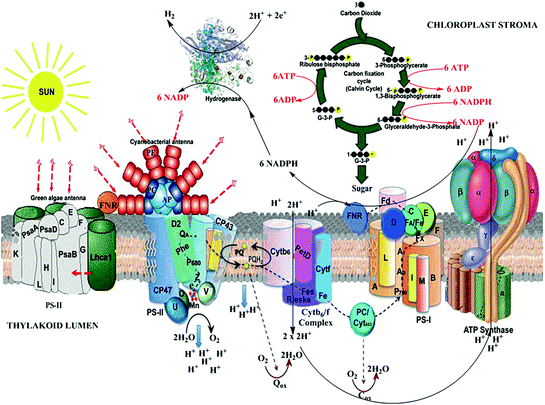

# Carbon Concentrating Mechanisms (CCM)

**This page is a brainstorming related to the potential use of carbon concentrating mechanisms to optimize plant growth.**&#x20;

<figure><figcaption>
<a href="https://www.researchgate.net/publication/357210022_Catalase_protects_against_nonenzymatic_decarboxylations_during_photorespiration_in_Arabidopsis_thaliana">https://www.researchgate.net/publication/357210022_Catalase_protects_against_nonenzymatic_decarboxylations_during_photorespiration_in_Arabidopsis_thaliana</a>
</figcaption></figure>

Schematic representation of photorespiration. Enzymatic reactions (R1–R6) typically associated with photorespiration are shown in black while nonenzymatic decarboxylation reactions (R7 and R8) are shown in red. R0 represents transport of glycolate into the peroxisomes. Glycolate oxidase (R1) catalyzes the conversion of glycolate to glyoxylate and H2O2. The latter molecule is decomposed to oxygen and water by catalase (R6). Glyoxylate is aminated by either glutamate glyoxylate aminotransferase (R2) or serine glyoxylate transaminase (R4) to produce glycine. Glycine is then decarboxylated to produce serine while releasing CO2, NH4, cycling tetrahydrofolate (THF) and methyl‐THF (M‐THF), and reducing NAD by a multienzyme complex, glycine–cleavage system, in the mitochondria. This conversion of glycine to serine is modeled as a single reaction (R3) where flux in R3 equally contributes to serine and CO2 formation. Hydroxypyruvate (HPyr) produced through serine glyoxylate transaminase (R4) is reduced by hydroxypyruvate reductase (R5) to form glycerate, which is transported back to the chloroplast for incorporation into the C3 cycle. Nonenzymatic decarboxylations can occur either between glyoxylate and H2O2 (R7) or between HPyr and H2O2 (R8), both releasing CO2 in the process.

## Fremyella diplosiphon&#x20;

**CCMs in Cyanobacteria**: CCMs in cyanobacteria involve the use of carboxysomes and CO₂ pumps to increase the concentration of CO₂ around the enzyme Rubisco, thereby enhancing photosynthetic efficiency. This system evolved when atmospheric CO₂ levels were much higher.

**Components of CCMs**: Key components include bicarbonate transporters, CO₂ pumps, and carboxysomes. These components help cyanobacteria efficiently fix CO₂, even under low CO₂ conditions and might work in multi-cellular crop species.

<figure><figcaption>
<a href="https://www.researchgate.net/publication/341653894_Linking_the_Dynamic_Response_of_the_Carbon_Dioxide-Concentrating_Mechanism_to_Carbon_Assimilation_Behavior_in_Fremyella_diplosiphon">https://www.researchgate.net/publication/341653894_Linking_the_Dynamic_Response_of_the_Carbon_Dioxide-Concentrating_Mechanism_to_Carbon_Assimilation_Behavior_in_Fremyella_diplosiphon</a>
</figcaption></figure>

**Engineering Crop Plants**: The text outlines a phased approach to introducing cyanobacterial CCM components into C₃ crop plants to improve their photosynthetic efficiency and water-use efficiency (WUE). This includes adding bicarbonate transporters, CO₂ pumps, and carboxysomes to chloroplasts while ensuring optimum tempaerature, humidity and nutrient supply.

<figure><figcaption>
<a href="https://link.springer.com/chapter/10.1007/978-3-319-09123-5_2">https://link.springer.com/chapter/10.1007/978-3-319-09123-5_2</a>
</figcaption></figure>

**Benefits for Crops**: Introducing CCMs into crops like rice, wheat, barley, and soybeans could significantly enhance their photosynthetic CO₂ fixation efficiency, potentially leading to higher yields and better performance under water-limited or otherwise stressful conditions.

**Challenges and Future Research**: Successful implementation requires extensive genetic engineering, thorough experimentation, and significant resources. Future efforts will focus on optimizing the expression of these components in crop plants and verifying their functionality to achieve the desired improvements in photosynthesis and WUE on Earth in feild and beyond.

## Awesome paper modelling carbohydrate metabolism and photorespiration.&#x20;



<figure><figcaption>
Model for carbon concentrating system: For discussion of the pathways see text. Enzyme abbreviations: CA: carbonic anhydrase; MDH: malate dehydrogenase; ME1: NAD malic enzyme, mitochondrial; PEPC: phosphoenolpyruvate carboxylase; PEPCK: phosphenolpyruvate carboxykinase; PK: pyruvate kinase; PPDK: pyruvate-phosphate dikinase; PYC: pyruvate carboxylase; RUBISCO: ribulose-1,5-bisphosphate carboxylase.
</figcaption></figure>

<figure><figcaption>
For simplicity, the number of oragenelle membranes has been reduced in this figure. A gene model for glycerate kinase (GK) could not be found in either genome. The bacterial-type glyoxylate to glycerate metabolism is not shown due to uncertainty in the localization of the enzymes. Enzyme Abbreviations: ACS: acetyl CoA synthetase; CTS: citrate synthase; GDC: glycine decarboxylase; GOX: glycolate oxidase; GK: glycerate kinase; HPR: hydroxypyruvate reductase /glycerate dehydrogenase; ICL: isocitrate lyase; ME1: NAD malic enzyme; MLS: malate synthase; PDH: pyruvate dehydrogenase; PGP: 2-phosphoglycolate phosphatase; RUBISCO: ribulose-1,5-bisphosphate carboxylase; SHMT: serine hydroxymethyltransferase; SPT/AGT: serine-pyruvate/alanine-glyoxylate aminotransferase.
</figcaption></figure>

### **In nature plants perform carbon concentration in both time (day/night) and space (intra-cellular and inter-tissue and even inter-organ)**

* C3 plants: Have higher rates of photorespiration. In the presence of oxygen, photosynthesis in C3 plants is reduced because oxygen acts as a competitive inhibitor for Rubisco. C3 plants are less efficient in hot and dry areas because their stomata must remain closed to prevent excessive water loss. Examples of C3 plants include cowpea, cassava, soybean, and rice.
* C4 plants: Minimize photorespiration by spatially separating the initial CO2 fixation and the Calvin cycle. C4 photosynthesis occurs in tropical plants, and produces a four-carbon intermediate that breaks into a three-carbon molecule for the Calvin cycle. C4 plants conduct the C4 pathway in the mesophyll cells and the Calvin cycle in the bundle sheath cells. Examples of C4 plants include sugar cane, maize, millet, and sorghum.
* CAM plants: Minimize photorespiration by using the crassulacean acid metabolism (CAM) pathway. CAM photosynthesis occurs in semi-arid environments, where carbon dioxide fixing takes place at night. CAM plants absorb energy during the day from sunlight and fix carbon dioxide at night. CAM plants conduct the C4 pathway at night and the Calvin cycle during the day. Examples of CAM plants include cacti and pineapples.

**Below:** Poster describing CAM metabolism (source: online ).&#x20;

<figure><figcaption></figcaption></figure>

<figure><figcaption></figcaption></figure>

## Paper on CAM engineering: [https://www.mdpi.com/1422-0067/24/17/13072](https://www.mdpi.com/1422-0067/24/17/13072)

<figure><figcaption>
Simplified schematic to illustrate the molecular relationships and distinctions among C3, C4, and CAM photosynthesis mechanisms. The CBB cycle is the abbreviation of Calvin-Benson-Bassham cycle, which is also known as Calvin cycle.
</figcaption></figure>

<figure><figcaption>
The same information shown a different way... 
</figcaption></figure>



<figure><figcaption>
a NADP-malic enzyme type of C4 pathway. b Carbon fixation in CAM plants.
</figcaption></figure>

But we need complete tissue illustration&#x20;

<figure><figcaption></figcaption></figure>
