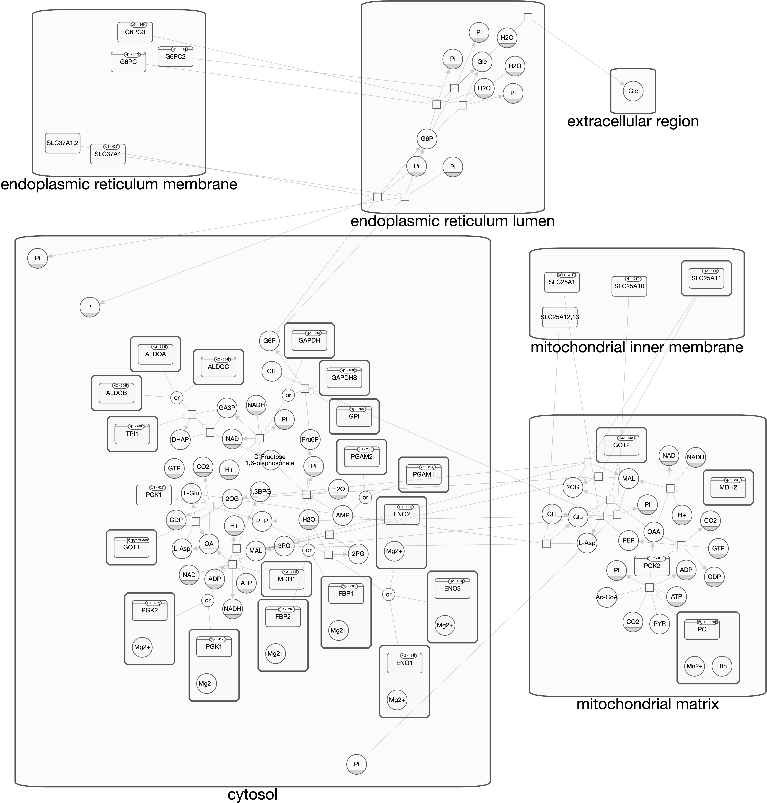

# Spaceflight plant respiration review

**Title:** Respiration in microgravity isn’t easy, even if you’re green.

**Abstract**: The process of anaerobic respiration plays a crucial role in plant physiology and has the potential to be harnessed to improve crop yield. To effectively manipulate this process, a deeper understanding of respiratory substrates is necessary. Mitochondria, the organelles that house the catabolic pathways and respiratory machinery, are central to this understanding, as they control the transport of substrates into and out of the organelles. However, the complex nature of mitochondrial carriers and catabolic pathways, which are not yet fully identified, presents a significant obstacle to probing respiratory substrates in plants. Moreover, respiratory substrates are subject to regulation based on cellular processes and spaceflight-related environmental factors. In this review, we explore the expression of enzymes related to the direct respiratory substrates that are transported through mitochondrial carriers and catabolized under normal and stressed conditions. Additionally, we suggest we need to evaluate the energetic yields, availability in cells, and the degree of oxidation of various respiratory substrates and cofactors during spaceflight. This information can be useful in determining which synthetic biology approaches may be suitable for altering the range of respiratory substrates in plants tailored for fractional gravity levels, ultimately optimizing respiration through the introduction, improvement, or control of specific mitochondrial transporters and catabolic pathways. Furthermore, the insights gained from this review can provide a foundation for future research aimed at improving crop yields and addressing the challenges associated with spaceflight and microgravity environments.

**Keywords: Mitochondria, TCA, spaceflight,**

_**“This is a crude mix of spaceflight and metabolic engineering review.” but it has potential?**_

**𝐓𝐡𝐞 𝐞𝐛𝐛𝐬 𝐚𝐧𝐝 𝐟𝐥𝐨𝐰𝐬 𝐨𝐟 𝐞𝐧𝐞𝐫𝐠𝐲 by** [**Dr. Daria Chrobok**](https://www.linkedin.com/in/dariachrobok?miniProfileUrn=urn%3Ali%3Afsd\_profile%3AACoAABl3-n0BFOSDEz-CVxabBP\_5mNuKIILs5Pg)

[**“I love to help make your Science memorable! How?**](https://www.linkedin.com/in/dariachrobok?miniProfileUrn=urn%3Ali%3Afsd\_profile%3AACoAABl3-n0BFOSDEz-CVxabBP\_5mNuKIILs5Pg)

[**With beautiful illustrations! Let's connect & see if I can help you!”**](https://www.linkedin.com/in/dariachrobok?miniProfileUrn=urn%3Ali%3Afsd\_profile%3AACoAABl3-n0BFOSDEz-CVxabBP\_5mNuKIILs5Pg)

<figure><figcaption></figcaption></figure>

<figure><figcaption>
<a href="https://www.researchgate.net/publication/337850288_Genetic_Engineering_for_Global_Food_Security_Photosynthesis_and_Biofortification">https://www.researchgate.net/publication/337850288_Genetic_Engineering_for_Global_Food_Security_Photosynthesis_and_Biofortification</a>
</figcaption></figure>

**Gluconeogenesis**

<figure><figcaption>
Metabolic model for Gluconeogenesis in Arabidopsis cells. 
</figcaption></figure>

<figure><figcaption></figcaption></figure>

Photorespiration: Schematic representation of photorespiration. Glycolate oxidase (GOX; EC 1.1.3.1), 2-phosphoglycerate phosphatase (PGP; EC 3.1.3.13), serine-glyoxylate transaminase (SGAT; EC 2.6.1.45), glycine:2-oxoglutarate aminotransferase (GGAT; EC 2.6.1.4), glycerate-3-kinase (GK; EC 2.7.1.31), hydroxypyruvate reductase (HPR; EC 1.11.81), glycine decarboxylase (GDC), catalase (CAT; EC 1.11.16), serine hydroxymethyltransferase (SHMT; EC 2.1.2.1), Rubisco (EC 4.1.1.39).&#x20;

**Analysis of Glycolysis in spaceflight reveal it is altered in a range of different stages that vary based on the flight hardware, tissue, genotypes and developmental stage**

<figure><figcaption></figcaption></figure>

**Introduction.**

***

Photosynthesis and respiration are two pivotal processes in the life cycle of plants, both on Earth and in extraterrestrial environments. Photosynthesis is responsible for assimilating carbon dioxide (CO2) into carbon-rich molecules, whereas respiration oxidizes a substantial portion of these molecules, releasing CO2 back into the surroundings. While photosynthesis depends exclusively on CO2, respiration involves a diverse range of reduced carbon molecules as sources of fuel, including sugars, amino acids, organic acids, fatty acids, chlorophylls, and other carbon compounds. The selection of these substrates for respiration is determined by the abundances and activity of metabolic enzymes within cells, which may not be fully adapted to the conditions faced by plants in current managed environments **\[Reference 1]**. Direct substrates for respiration are channelled into the mitochondrial matrix and utilized to produce reducing equivalents. These equivalents are crucial for driving the electron transport chain (ETC) and oxidative phosphorylation in mitochondria, a process that may or may not involve the release of CO2 **\[Reference 2]**.

Efficiency in ATP generation through respiration is complicated by the partial oxidation of respiratory substrates and the occurrence of non-phosphorylating pathways in the ETC. The debate on the ideal balance between "maintenance" and "growth" respiration is ongoing, and the influence of specific substrates on this balance remains unclear **\[Reference 3]**. Furthermore, the notion of "optimal respiration," which ensures the maintenance of cellular redox states, supports the ideal photosynthetic capacity, and enhances growth, biomass, and yield, is difficult to quantify. The understanding of major respiratory substrates throughout the diurnal cycle, under stress, and across plant developmental stages is still incomplete **\[Reference 4]**.

The unique conditions of microgravity and other aspects of spaceflight have been shown to significantly impact plant respiration, indicating that optimizing respiratory substrates under such conditions is crucial. Microgravity can lead to alterations in plant metabolic pathways, including those involved in respiration **\[Reference 5]**. This review aims to provide an updated overview of recent discoveries concerning respiratory substrates under terrestrial conditions and contrast these with plant responses to spaceflight, seeking to identify gaps in our current understanding as we pursue respiratory optimization in plants for terrestrial agroecosystems, low Earth orbit (LEO), and beyond.

***

1. \[Placeholder for reference on metabolic enzyme abundances and regulation] - DOI
2. \[Placeholder for reference on direct substrates for respiration] - DOI
3. \[Placeholder for reference on the debate of maintenance and growth respiration] - DOI
4. \[Placeholder for reference on understanding of respiratory substrates] - DOI
5. \[Placeholder for reference on microgravity effects on plant metabolism ] - DOI

<figure><figcaption></figcaption></figure>

**Figure 1:** Differentially expressed pathways from the matrix meta-transcriptome. KEGG pathway viewer shows changes in photosynthetic and respiration-related apparatus and downstream metabolic pathways (Supplementary figure Barker et al., 2023).

**Respiration in plant roots**

Arabidopsis root tissues have varying functions and undergo respiration through different pathways and reactions depending on their stage of development. The epidermal cells, in their mature stage, synthesize cutin to prevent water loss and are sensitive to drought and salt stress. The trichoblasts, in their elongation stage, elongate root hairs for nutrient uptake and synthesize flavonoids for UV protection, and are sensitive to nutrient deficiencies and UV radiation. The cortical cells, in their mature stage, synthesize cellulose for cell wall strength and lipid metabolism for energy storage and are sensitive to salt stress and fungal pathogens. The endodermal cells, in their mature stage, synthesize suberin to control water and nutrient uptake and are sensitive to water stress and nutrient deficiencies. The pericycle cells, in their elongation stage, transport auxin for root growth and lateral root initiation and are sensitive to auxin-deficient conditions. The vascular cells, in their differentiation stage, form xylem and phloem for nutrient and water transport and synthesize lignin for cell wall strength, and are sensitive to water stress and fungal pathogens. The root cap cells, in their differentiation stage, synthesize mucilage for seed germination and gravity sensing for root orientation and are sensitive to gravity and water stress. Finally, the quiescent center cells, in their maintenance stage, maintain stem cells for growth and repair, and are sensitive to DNA damage and oxidative stress. Thus, respiration rates change as cells progress through developmental stages in Arabidopsis root tissues. In general, younger cells have higher respiration rates than older cells, as they are actively dividing and require more energy. During the early stages of development, the root apical meristem, where new cells are generated, has high respiration rates. As the cells differentiate and become specialized, respiration rates decrease. Once the cells have matured and stopped dividing, their respiration rates stabilize at a lower level. Additionally, respiration rates may also vary depending on environmental conditions, such as temperature, oxygen availability, and nutrient availability (**See Root Tissue Table X).**

* \[Placeholder for reference on epidermal cell mechanisms and sensitivities]
* \[Placeholder for reference on trichoblast functions and environmental sensitivities]
* \[Placeholder for reference on cortical cell synthesis and stress responses]
* \[Placeholder for reference on endodermal cell synthesis and stress sensitivities]
* \[Placeholder for reference on pericycle cell auxin transport and sensitivities]
* \[Placeholder for reference on vascular cell functions and environmental challenges]
* \[Placeholder for reference on root cap cell synthesis and environmental sensitivities]
* \[Placeholder for reference on quiescent center cell maintenance and stress responses]
* \[Placeholder for environmental influence on respiration rates in Arabidopsis]

**Pyruvate transporters**

Pyruvate serves as the primary substrate for eukaryotic mitochondrial respiration rate, and its transportation to the mitochondrial matrix is facilitated by mitochondrial pyruvate carriers (MPCs) residing in the inner mitochondrial membrane. The first step of pyruvate oxidation is carried out in the matrix by the mitochondrial pyruvate dehydrogenase complex (mtPDC) that yields acetyl-CoA, NADH, and CO2. Knocking out either MPCs or mtPDC has been found to have a detrimental effect on mammalian cell development (Gray et al., 2014; McCommis et al., 2015; Johnson et al., 2001; Gopal et al., 2018). In contrast, the plasticity of pyruvate provision to respiration in plant mitochondria appears to be greater. Mutations in PDC subunits in Arabidopsis cause retardation in organ size and root length, but abolition of pyruvate mitochondrial transport does not grossly affect plant vegetative growth phenotypes (LeClere et al., 2004; Taylor et al., 2004; Quint et al., 2009; Yu et al., 2012; Song and Liu, 2015; Li et al., 2014; Wang et al., 2014; He et al., 2019). However, detailed biochemical studies of mutants in transporters and metabolic enzymes in Arabidopsis show that while pyruvate imported via MPC is a major pathway providing pyruvate to mitochondria, at least two other pathways work cooperatively with MPC to provide sufficient pyruvate for plant respiration and growth (Le et al., 2021). These include pyruvate production from alanine and malate inside the mitochondria, internal pyruvate production via NAD-dependent malic enzyme (NAD-ME), and an alanine shuttle via reversible alanine aminotransferase (AlaAT) reactions that are situated in the cytosol and the mitochondrial matrix (Liepman and Olsen, 2003). This means that alanine and malate act as direct respiratory substrates via their conversions to pyruvate inside plant mitochondria. Loss of any one of these systems does not affect vegetative phenotypes in Arabidopsis (Le et al., 2021).

**Figure 2:** Natural variation of expression of loci associated with the TCA cycle in the BRIC hardware during BRIC19 and BRIC20. RNAseq analysis.

Vector files can replace from DRB AWG supplementary slides

Spaceflight and microgravity have been found to have an impact on mitochondrial respiration in various organisms, including plants (**GeneLab REF, Choi et al., 2017, Barker et al etc..?**). In Arabidopsis, spaceflight has been shown to increase the activity of the alternative oxidase pathway, which is involved in mitochondrial respiration, suggesting a shift in respiratory substrate utilization (Battista et al., 2020). Microgravity has also been found to affect mitochondrial respiration and energy metabolism in human cells, which could have implications for long-term spaceflight missions (Wang et al., 2017). Thus, understanding the various pathways involved in providing pyruvate as a respiratory substrate in different organisms and the effects of spaceflight and microgravity on mitochondrial respiration is essential for developing strategies to support life in space.

**Pyruvate**

The production of pyruvate is crucial for plant respiration, which heavily depends on the catabolism of daily replenished starch reserves and sugars from photosynthetic tissues (MacNeill et al., 2017). Cytosolic glycolysis primarily supplies pyruvate for mitochondrial respiration, fed via the triose phosphate translocator (TPT) that exports 3-PGA from the Calvin–Benson cycle in chloroplasts to the cytosol (Walters et al., 2004; Schmitz et al., 2012). Additionally, direct usage of plastid 3-PGA to produce pyruvate via MPC for mitochondrial respiration in the light is facilitated by the physical association of chloroplasts and mitochondria through TPT (Zhang et al., 2020). Spaceflight and microgravity have been found to impact respiration rate, photosynthesis, and reactive oxygen species (ROS) production, affecting plant growth and development (Paul et al., 2019).

**Alanine**

Pyruvate is produced via alanine aminotransferase (AlaAT) by converting alanine into pyruvate, ensuring a supply from versatile carbon and nitrogen storage molecules. This interconversion is essential for plant hypoxia responses and is a key metabolite in C4 plants (Mallmann et al., 2014; Rao and Dixon, 2016; Schlüter et al., 2019). Over-expressing AlaAT in plants increases biomass and yield, showing that the flexibility of using pyruvate and alanine as respiratory substrates enhances plant yield (McAllister and Good, 2015; Good et al., 2007; Shrawat et al., 2008). Studies on spaceflight and microgravity reveal that plants grown in microgravity exhibit altered gene expression patterns, indicating changes in amino acid metabolism (Zupanska et al., 2013).

Spaceflight and microgravity affect biological systems, including metabolism and gene expression. In plant cells, organic acids like malate are crucial for the TCA cycle, essential for energy production. Malate enters the cycle via NAD-malate dehydrogenase (NAD-MDH), the final enzyme ensuring optimal ATP production, particularly in the dark (Tomaz et al., 2010). Malate also engages in a shuttle with oxaloacetate, influencing the NADH/NAD+ ratio, activating respiratory components, and playing roles in stomatal closure, pH, and redox balance (Selinski and Scheibe, 2019). Studies reveal at least two primary pathways for importing malate into the mitochondrial matrix, suggesting different transport mechanisms for its roles inside mitochondria (Lee et al., 2021). Additionally, malate accumulates in the vacuole during the day and serves as a respiratory substrate at night, aiding the usage of amino acids, fatty acids, and chlorophylls for respiration (Fahnenstich et al., 2007; Maurino and Engqvist, 2015). These insights underline the importance of malate and NAD-MDH in the TCA cycle and their potential roles in adapting to spaceflight and microgravity conditions.

**Malate**

The oxidation of malate to pyruvate via NAD-ME produces NAD(P)H and CO2 and has a high respiratory quotient for complete malate oxidation. However, its use as a respiratory substrate through NAD-ME is limited, even in the absence of MPC and AlaAT, resulting in shoot and root growth deficiencies (Le et al., 2021). Pyruvate imported via MPC is prioritized over NAD-ME-derived pyruvate for citrate production in the TCA cycle and respiration due to substrate channeling-like behavior between MPC and PDC (Le et al., 2022). Pyruvate from imported malate is mainly exported for amino acid or fatty acid biosynthesis in other cell compartments (Le et al., 2021). The effects of spaceflight and microgravity on NAD-ME and malate metabolism in plants are not well-studied. However, the malate biosynthesis enzyme FUM is elevated in WS Arabidopsis seedling roots and shoots grown under light in microgravity. The Veggie hardware and the ISS (fig.3) show that FUM is potwentially elevated and this could indicate either increased quantities of S-Malate or decreased qunaitties of its precusor. The EFP data from BAR torronto indicates that FUM is likely to have high expression in the cells of first tier of the collumella.  Recent single cell sequencing data indicates that FUM may also have a high level of expression in the protoxylem cells.

<figure><figcaption>
FUM EFP results and predictions
</figcaption></figure>

<figure><figcaption>
FUM single cell sequencing results and predictions
</figcaption></figure>

**Figure 3:** FUM expression during the VEGGIEs 02 mission. EPlant EFP browser predicts high expression in the columella 1st tier cells, along with predicted expression in the meristematic and elongation region, while single cells sequencing data from the EBI expression atlas predict protoxylem expression.

**Citrate**

Citrate, a versatile organic acid produced by the TCA cycle, serves as a crucial respiratory substrate during both the day and night making it diffcult to understant what role it may play in plants adaption to space flight. In the light, citrate is generated by a non-cyclic form of the TCA cycle and is exported for vacuolar storage or amino acid biosynthesis (Eprintsev et al., 2015b). Conversely, respiration by the cyclic TCA cycle extracts energy from citrate at night (Cheung et al., 2014; Tcherkez et al., 2017). Citrate is stored in the vacuole at high concentrations, suggesting its potential to act as a respiratory substrate. In fact, citrate can re-enter mitochondria via citrate importers and enter the TCA cycle when glycolytic flux and NADH concentration are low, indicating its importance as a respiratory substrate (Igamberdiev and Eprintsev, 2016).

In addition to its role as a respiratory substrate, citrate also plays a crucial role in redox balance. A homolog of the succinate-fumarate carrier (SFC) has been shown to exhibit citrate/isocitrate exchange transport activity, indicating its potential to transport citrate (Brito et al., 2020). The MDH-citrate synthase-aconitase (MDH-CS-ACO) metabolon reserves a pool of mitochondrial citrate for further oxidation to generate NADH (Huang et al., 2018). In yeast, a separate citrate synthase-citrate exporter metabolon has been identified to generate a protected pool of citrate for export from mitochondria (Grigorenko et al., 1990). While the latter has yet to be confirmed in plants, the role of DIC2 in importing malate in exchange for mitochondrial citrate suggests a pool of mitochondrial citrate is exported to generate NADPH in the cytosol to create reducing power in the light for maintenance respiration and secondary metabolism (Lee et al., 2021).

The effects of spaceflight and microgravity on citrate metabolism have been studied extensively, with evidence showing changes in citrate synthesis and export in microgravity conditions (Choi et al., 2017). These changes have been attributed to the altered expression of genes involved in the citrate metabolic pathway, indicating the potential for microgravity to affect citrate metabolism at the molecular level (Choi et al., 2017; Ferl and Paul, 2016). Moreover, studies have also shown that microgravity can lead to changes in the morphology and structure of mitochondria, potentially affecting their ability to generate and utilize citrate as a respiratory substrate (Ferl and Paul, 2016). Overall, the multifaceted roles of citrate in plant metabolism, coupled with its sensitivity to microgravity conditions, make it an intriguing subject of study for understanding the effects of spaceflight on plant physiology.

**Succinate**

Succinate is a key molecule involved in energy metabolism in plant cells that may have its metabolism influences by space flight (See TCA cycle in **Figure 2**). It can be synthesized from succinyl-CoA within the TCA cycle in plant mitochondria, as well as imported into mitochondria from the cytosol via transporters such as DICs and SFC (Picault et al., 2002; Palmieri et al., 2008; Catoni et al., 2003). In mitochondria, succinate contributes directly to respiration by transferring electrons within complex II to ubiquinone, while also indirectly contributing to the production of malate and NADH (Huang and Millar, 2013; Belt et al., 2017; Restovic et al., 2017).

Beyond the TCA cycle, succinate can also be produced via the glyoxylate cycle in peroxisomes during germination of oil-storing seeds, and in leaves during photosynthesis (Eprintsev et al., 2015a). The glyoxylate cycle allows for lipid mobilization and the production of succinate and malate, which can be exported to the cytosol for gluconeogenesis (Cornah et al., 2004; Eastmond et al., 2015). Succinate generated through the glyoxylate cycle can then enter the TCA cycle, producing NADH and ATP (Eastmond and Graham, 2001; Thorneycroft et al., 2001).

Interestingly, spaceflight and microgravity have been shown to affect plant metabolism, including the production of succinate. In Arabidopsis plants grown in space, changes in gene expression and metabolite levels were observed, including upregulation of genes involved in the TCA cycle and glyoxylate cycle, as well as increased levels of succinate and malate (Zupanska et al., 2013). Similarly, studies on Arabidopsis seedlings grown in microgravity found alterations in metabolite levels, including a significant increase in succinate compared to ground controls (Valbuena et al., 2019). These findings suggest that spaceflight and microgravity may impact plant metabolism and the production of key metabolites such as succinate, potentially affecting plant growth and development in these unique environments.

**Glycine**

The utilization of photosynthetic by-products for energy generation is crucial in plant metabolism and may vary in the spaceflight environment (See TCA cycle in **Figure 2**). Glycine, a low-cost amino acid, plays a pivotal role as a respiratory substrate under normal conditions. In C3 plants, glycine oxidation is the primary pathway for mitochondrial redox equivalent generation in light, accounting for over 50% of mitochondrial NADH, particularly under high light conditions that transcriptionally resemble space flight as observed within a BRIC (Choi et al., 2017).

The transport of glycine into plant mitochondria is inhibited by mersalyl and glycine analogues, yet the exact carrier remains unknown. Once inside, glycine is converted to serine via GDC and serine hydroxymethyltransferase, releasing CO2, NH4+, and NADH. Spaceflight and microgravity have shown to impact the photorespiratory cycle and generation of respiratory substrates like glycine. Research indicates alterations in enzyme activity and metabolite levels in plants grown under microgravity. Optimizing the use of glycine and other respiratory substrates for energy in plants is a promising research area with potential implications for space agriculture and exploration.

**Amino Acids**

Plants primarily use carbohydrates for respiration. When carbohydrates are scarce, they utilize amino acids from protein degradation as alternative substrates. However, not all amino acids are equally efficient for respiration, as some are energetically expensive to synthesize and incorporate into proteins. Amino acids like proline, glutamate, and branched-chain amino acids (BCAAs) are used during stress recovery, while costly amino acids like arginine, histidine, tyrosine, tryptophan, and phenylalanine are typically precursors for secondary metabolites. The catabolic pathways for most aromatic amino acids in plants remain unclear. Additionally, formate, a byproduct of abiotic stress, is oxidized in mitochondria.

<figure><figcaption></figcaption></figure>

**Figure X:** Summary of amino acid metabolism from GeneLab.

Vector file can replace from DRB AWG supplementary slides

**Proline**

The effects of spaceflight and microgravity on plants also impact their respiratory substrates. Proline, known to accumulate during salt and osmotic stress, plays crucial roles in osmoprotection and reactive oxygen species (ROS) defense. Plant mitochondria, during proline catabolism, contain proline dehydrogenase and 1-pyrroline-5-carboxylate dehydrogenase to facilitate this process.

Proline serves as a respiratory substrate in both intact plant tissues and isolated mitochondria. However, its catabolism can surpass the capacity and energy needs of plant cells, triggering the expression of non-phosphorylating bypasses like alternative oxidase (AOX). A loss of AOX expression increases ROS generation and extends the recovery period for plants after proline accumulation due to salt stress. This phenomenon was highlighted in a meta-analysis by Barker et al. (2020), which showed that spaceflight affects AOX expression.

During dark-induced senescence, proline oxidation generates glutamate, and the electron flux proceeds through the cytochrome pathway for ATP synthesis.

**Glutamate**

Spaceflight and microgravity significantly impact plant physiology and metabolism, particularly the amino acid glutamate's role in nitrogen and carbon signaling. Glutamate links carbon and nitrogen metabolism, especially during germination (Day et al., 1988). It is imported into plant mitochondria by A BOUT DE SOUFFLE (BOU), homologous to yeast mitochondrial glutamate transporter Ycm2p (Eisenhut et al., 2013; Porcelli et al., 2018). In mitochondria, glutamate dehydrogenase (GDH) oxidizes glutamate to produce 2-OG, NADH, NH4+, and CO2, fueling the TCA cycle (Labboun et al., 2009).

Under stress, cytosolic glutamate converts into γ-aminobutyric acid (GABA) via glutamate decarboxylase (Qiu et al., 2020). GABA enters mitochondria through GABA permease (GABP), where GABA shunt enzymes produce succinate, feeding the TCA cycle and generating NADH (Michaeli et al., 2011). This pathway activates under stresses such as starvation, salinity, and hypoxia (Rolletschek et al., 2011; António et al., 2016; Wang et al., 2017; Che-Othman et al., 2020; Jethva et al., 2022).

The GABA shunt is crucial for wheat leaves' increased respiration, providing an alternative carbon source for metabolic processes under limited carbon supply (Dissanayake et al., 2022). Space-grown plants show altered gene expression, impacting glutamate signaling and possibly explaining wavy root growth and tropic orientation changes (Paul et al., 2019).

**Branched-chain amino acids (BCAAs)**

The degradation pathways of branched-chain amino acids (BCAAs) like valine, leucine, and isoleucine are crucial for plant survival during sugar starvation (Hirota et al., 2018). BCAA catabolism mainly occurs in the cytosol, but some enzymes for leucine degradation are found in plant mitochondria, making leucine an effective alternative substrate for respiration (Binder, 2010). Key enzymes of BCAA metabolism, including branched chain α-keto acid dehydrogenase complex and isovaleryl-CoA dehydrogenase, reside in mitochondria, generating NADH or transferring electrons from α-keto-acids to the ubiquinone pool via the electron-transfer flavoprotein/electron-transfer flavoprotein:ubiquinone oxidoreductase complex (ETF/ETFQO) (Kochevenko et al., 2012).

Regulation of BCAA catabolism involves the SNRK bZIP signal transduction pathway, which directly regulates the ETFQO promoter under carbon starvation (Cavalcanti et al., 2017; Pedrotti et al., 2018). Knocking out ETFQO-1, SNRK, BZIP, and other BCAA catabolism enzymes, such as isovaleryl-CoA dehydrogenase, decreases respiration rate and makes plants more sensitive to extended darkness, leading to increased senescence and decreased leaf quantum yield (Pedrotti et al., 2018). Additionally, BCAA catabolism generates acetyl-CoA in the cytosol or mitochondria, fueling the tricarboxylic acid (TCA) cycle (Hildebrandt et al., 2015; Arruda and Barreto, 2020).

BCAA accumulation is toxic to plant growth, making their metabolism a priority after stress, such as during salt stress (Huang and Jander, 2017; Batista-Silva et al., 2019). Mutants lacking BCAA catabolism enzymes are also more drought-sensitive compared to wild-type plants (Engqvist et al., 2011; Pires et al., 2016). Moreover, spaceflight and microgravity affect plant growth and metabolism. Space-grown plants show alterations in gene expression and metabolic pathways, including BCAA metabolism, impacting their fitness and survival in space (Correll et al., 2013; Paul et al., 2017). Understanding the effects of spaceflight on BCAA metabolism is vital for space agriculture and long-term space missions.

**Serine**

Serine, a notable amino acid, is primarily recognized as a mitochondrial product rather than a respiratory substrate due to the absence of plant mitochondrial serine catabolic pathways. However, emerging research indicates that serine may serve as a substrate for mitochondrial respiration. Abundantly produced from glycine during light-driven photorespiration, serine is transported through the cytosol to the peroxisome to complete the cycle, with some being diverted for cysteine synthesis (Bonner et al., 2005).

Serine is also synthesized from glycolytic intermediates in the cytosol or plastid and can enter mitochondria independently of the photorespiratory pathway (Haas et al., 2008; Kory et al., 2018). It can reach concentrations exceeding 10 mM in the cytosol and phloem sap, making it one of the most prevalent amino acids after glutamate and aspartate (Igamberdiev and Kleczkowski, 2018). A plant serine dehydratase (serine racemase) in the cytosol can convert serine to pyruvate (Fujitani et al., 2006), which may enter mitochondria and support respiration.

Using serine as a mitochondrial pyruvate source is inefficient if serine must exit mitochondria and re-enter as pyruvate due to transport constraints and competing pathways in the cytosol. Interestingly, studies show spaceflight and microgravity impact plant metabolic pathways, including those involving serine (Johnson et al., 2021; Schwendner et al., 2021). Exploring serine's role in plant respiration under these conditions could offer new insights into plant metabolism and stress responses.

**Lysine**

The effects of spaceflight and microgravity on lysine catabolism in plants have been examined. Lysine accumulates in _Arabidopsis thaliana_ grown in microgravity, indicating that spaceflight alters lysine metabolism (Correll et al., 2013). Transcriptomic analysis reveals changes in the expression of genes involved in lysine metabolism and transport in these conditions (Paul et al., 2019). Understanding lysine catabolism under varying environments is essential. The generation of 2-oxoglutarate (2-OG) from lysine via D-2HGDH supports TCA cycle activity, aiding in normal respiration and biosynthesis, especially when compensating for mutations in NAD- and NADP-isocitrate dehydrogenase (Boex-Fontvieille et al., 2014).

Lysine is a crucial amino acid in plant metabolism. Its catabolism begins in the cytosol, converting lysine into 2-aminoadipate-6-semialdehyde (AASA). The next enzyme, α-aminoadipate semialdehyde dehydrogenase, functions in the cytosol or mitochondria, producing α-aminoadipate and NADH (Arruda and Barreto, 2020; Fuchs et al., 2020). Recent studies indicate that mitochondria generate D-2-hydroxyglutarate (D-2-HG) from lysine products (Engqvist et al., 2011). The mitochondrial D-2HGDH enzyme oxidizes 2-HG and donates electrons to the electron transport chain (ETC) through the ETF/ETFQO complex (Araújo et al., 2010). Either AASA or 2-HG may enter mitochondria as direct respiratory substrates. Notably, 2-HG accumulates in D-2HGDH mutants or during environmental stress, potentially inhibiting transaminases and transporters of other respiratory substrates (Engqvist et al., 2011).

**Figure XX:** WS VEGGIES02 shows changes in isocitrate dehydrogenase expression. This may be evidence of ABA signalling that can lead to changes in stomatal aperture (ref to support link).

**Formate**

Formate is vital in plants, playing a key role in mitochondrial metabolism and photorespiration. It is produced under abiotic stresses like hypoxia, aluminum toxicity, and low pH, and its breakdown is tied to mitochondrial function (Nunes-Nesi et al., 2014; Lou et al., 2016). Spaceflight and microgravity can also influence formate metabolism. Studies show increased formate accumulation in Arabidopsis thaliana under spaceflight conditions due to altered gene expression (Mortley et al., 2005; Stutte et al., 2006). Microgravity affects formate dehydrogenase (FDH) activity, the enzyme responsible for formate degradation, in some microorganisms (Gao et al., 2019). In stressed plants, formate can be produced during photorespiration from serine, from methanol metabolism, or from glyoxylate (Alekseeva et al., 2011). Formate is primarily metabolized by mitochondrial FDH, which is known to induce FDH expression (Hourton-Cabassa et al., 1998; Shingaki-Wells et al., 2014). FDH activity generates NADH in the mitochondrial matrix, which feeds into the electron transport chain, aiding ATP synthesis and CO2 release (Alekseeva et al., 2011).

**Chlorophyll recycling**

Chlorophyll breakdown is a well-known response to various stresses, including senescence, carbon or nitrogen starvation, spaceflight, and microgravity (Hörtensteiner and Kräutler, 2011; Gutbrod et al., 2019). This process enables the recycling of nitrogen and possibly carbon from the chlorin ring and prenyl side chains. After magnesium removal, the chlorin ring converts into pheophorbide a, which then transforms into non-fluorescent chlorophyll catabolites that accumulate in the vacuole (Pruzinská et al., 2005; Hörtensteiner and Kräutler, 2011).

Mass spectrometry experiments have shown that the main breakdown products of the prenyl side chain are phytols (Mach, 2015). Although the phytol degradative pathway provides substrates for respiration during sugar starvation (Ishizaki et al., 2005), its components are not fully identified (Durrett and Welti, 2021). Phytol degrades to phytenal and then to phytanoyl-CoA via unknown steps (Ishizaki et al., 2005). In mammals, phytanoyl-CoA undergoes α- and β-oxidation in peroxisomes and mitochondria (Kohlmeier, 2015; Durrett and Welti, 2021; Gutbrod et al., 2021). In plants, phytanoyl-CoA hydroxylase and 2-hydroxy-phytanoyl-CoA lyase, localized in peroxisomes, are the main pathway for phytanoyl-CoA metabolism (Araújo et al., 2011a; Yang et al., 2022).

Despite the absence of β-oxidation pathways in plant mitochondria, isobutyryl-CoA from peroxisomal oxidation could potentially act as a respiratory substrate, contributing electrons to the ubiquinol pool via ETF/ETFQO, leading to oxygen consumption and ATP synthesis (Däschner et al., 2001; Yang et al., 2022). However, proof of such transport and the identity of a mitochondrial isobutyryl-CoA transporter is lacking (Hildebrandt et al., 2015; Hildebrandt, 2018). Earlier steps in phytol metabolism may produce acetyl-CoA, succinate, and formate (Kohlmeier, 2015), each of which can serve as direct respiratory substrates via known pathways.

Spaceflight and microgravity can change the expression of genes related to photosynthesis and carbohydrate metabolism in plants, affecting chlorophyll breakdown and phytol metabolism (Paul et al., 2013; Dutta Gupta and Roychoudhury, 2017). Microgravity also impacts plant growth and development, altering gravitropism, cell wall composition, and nutrient uptake (Kwon et al., 2019). These effects may influence chlorophyll breakdown and phytol metabolism in space-grown plants, warranting further investigation.

**Acetate**

The role of acetate as a respiratory substrate in plants is often overlooked, despite its importance in microorganisms (De Mets et al., 2019). Recent studies show that plants can use external acetate as a carbon source, incorporating it into biomass and supporting energy production (Hann et al., 2022). Spaceflight and microgravity impact plant metabolism, altering gene expression, protein content, and metabolic pathways (Fuentes et al., 2021). Acetate produced during carbon metabolism in plant cells can reach up to 1 mM in green tissues (Bodo and Stumpf, 1982). Isotopically labeled acetate studies reveal rapid carbon entry into the TCA cycle, indicating that acetate converts into acetyl-CoA in plastids and peroxisomes before entering mitochondria as a respiratory substrate (Lin and Oliver, 2008). Knocking out both plastid ACS and peroxisomal ACL1 increases endogenous acetate levels, delays growth, and causes sterility, while losing only one has no significant effect (Turner et al., 2005; Sofeo et al., 2019). ACL1 is crucial for incorporating acetate-derived carbon into TCA intermediates, whereas ACS incorporates it into leucine and fatty acids via acetyl-CoA (Pracharoenwattana et al., 2005; Fu et al., 2020).

**Photorespiration**

Under hypoxic or drought stress, enzymes like pyruvate decarboxylase (PDC) and acetaldehyde dehydrogenase are induced, while mtPDC is restricted. This results in the "pyruvate dehydrogenase shunt" in leaves, bypassing PDC to convert pyruvate to acetyl-CoA via acetate. This adaptive response to thiamin diphosphate deficiency leads to temporary PDC inactivity (Oliver et al., 2009; Mithran et al., 2014; Kim et al., 2017; Joshi et al., 2019). These findings suggest that acetate catabolism plays a role as a substrate for mitochondrial respiration via acetyl-CoA metabolism, under both normal and stress conditions.

**Sucrose Synthase And Its Functional Implications**

Sucrose transport is central to carbon allocation in vascular plants. Plants manage carbon distribution during growth by coordinating sucrose synthesis and cleavage across various organs and cellular locations. Sucrose synthase, which catalyzes sucrose synthesis and cleavage reversibly, offers a direct means to regulate sucrose flux. Depending on the metabolic environment, sucrose synthase relocates within the cell to aid in cellulose, callose, and starch biosynthesis through its interactions with membranes, organelles, and cytoskeletal actin. The AtSus1 X-ray structure sheds light on sucrose catalysis and cleavage, the regulation of sucrose synthase, and its cellular interactions. Natural variations in these protein structures could adjust sucrose synthesis flux, enabling rapid adaptation to changes in oxygen or sucrose availability.

**Plastid adaptation**

Plastids play a crucial role in the adaptation to hypoxia during spaceflight (fig. 1. KEGG pathway map showing changes in plastid ontology group). Chlorophyll a and b, carotenoids, xanthophylls, and phycobilins are involved in light absorption for photosynthesis and photoprotection. ATP and NADPH are produced by photosynthesis and used for energy storage and transfer and reducing power for carbon fixation, respectively. Sugars and starch are synthesized in the Calvin Cycle for carbohydrate synthesis and storage, and lipids are synthesized for membrane synthesis and energy storage. Proteins, such as Rubisco and photosystem proteins, are involved in carbon fixation and light absorption. These components work together to support plastid function in low-oxygen environments, which is important during spaceflight (**See subcellular locations table X**).

**Retrograde signalling: Signals from Chloroplast and Mitochondria that Influence Gene Expression**&#x20;

Retrograde signaling entails communication from organelles, like chloroplasts and mitochondria, back to the nucleus to adjust the expression of nuclear genes. This bidirectional interaction is pivotal in maintaining cellular homeostasis and ensuring that the cellular environment can respond adequately to changing conditions. Chloroplasts and mitochondria are semi-autonomous organelles containing their own genomes, which encode a limited number of proteins. Most of the proteins necessary for the function and maintenance of these organelles are encoded by nuclear genes, synthesized in the cytoplasm, and imported into the organelles.

Understanding signaling mechanisms is crucial for cell coordination and functionality under various conditions. Research into retrograde signaling offers insights for plant breeding, crop improvement, and targeting mitochondrial-related diseases. In chloroplasts, retrograde signals respond to environmental factors like light and nutrients, regulating genes involved in photosynthesis. In mitochondria, these signals relate to energy status, affecting genes for biogenesis, respiration, and apoptosis. Retrograde signaling is triggered by metabolic changes, redox states, or stress factors such as ROS, adjusting gene expression to manage stress and optimize function. Miscommunication in these pathways can lead to dysfunction or disease.

**Nuclear structural components that might be important during hypoxia**

During spaceflight-induced hypoxia, nuclear components exhibit resilience and maintain their functions. DNA continues to transmit genetic information. Histones keep packaging DNA and regulating gene expression. Transcription factors sustain regulation of gene expression. mRNA, tRNA, and rRNA persist in transferring genetic information and synthesizing proteins. Nucleotides continue to synthesize nucleic acids. Poly(A) RNA remains active in processing RNA. Nuclear proteins maintain their roles in DNA replication, repair, and gene regulation. The nuclear envelope still separates the nucleus from the cytoplasm and manages molecular transport. Chromatin continues to package DNA and regulate gene expression. Histone modifications sustain regulatory functions. The nuclear lamina retains its structural and regulatory roles. Cajal bodies and nuclear speckles persist in RNA processing and snRNP assembly. PML bodies continue their roles in DNA repair and gene regulation. (\*\*See subcellular locations table X).

### **Conclusion**

The energy generated by mitochondria in plants powers various processes, including the uptake of minerals from the soil. This mineral transport into plant roots is an active process that requires ATP (adenosine triphosphate), produced by mitochondria during cellular respiration. Specialized transport proteins in the plasma membrane of root cells use ATP to pump minerals against a concentration gradient, from the soil into root cells. This active transport requires energy to move molecules against their concentration gradient.

Mitochondria not only provide energy for active transport but also play a key role in the biosynthesis of molecules essential for mineral uptake in plants. They produce heme, a cofactor for many transporters that facilitate iron and other metal absorption. Additionally, mitochondria synthesize various amino acids and organic acids crucial for mineral uptake and metabolism. Without the energy from mitochondria, plants would struggle to efficiently absorb and utilize necessary nutrients for survival and growth.

Future potential for synthetic bypasses has been developed to optimize plant yield by improving photosynthesis and respiration, including shortcutting photorespiration and reducing carbon loss. Theoretical redesign of respiration under suitable conditions can generate an optimal system by using appropriate respiratory substrates at the right times. Energetic accounting helps determine which substrates to prioritize by weighing their reductant and ATP yield against carbon loss and oxygen utilization stoichiometries. Additionally, understanding the effects of spaceflight and microgravity on plant respiration can inform optimal respiration strategies. The sophisticated regulation of mitochondrial metabolism, with separate metabolic pools and potential artificial metabolic channels, offers further opportunities for manipulating plant respiration. Future research can explore the formation and regulation of metabolic channels to optimize metabolic shifts at specific developmental stages or under stress. Controlling plant respiration can lay the foundation for significant improvements in plant growth and productivity.

